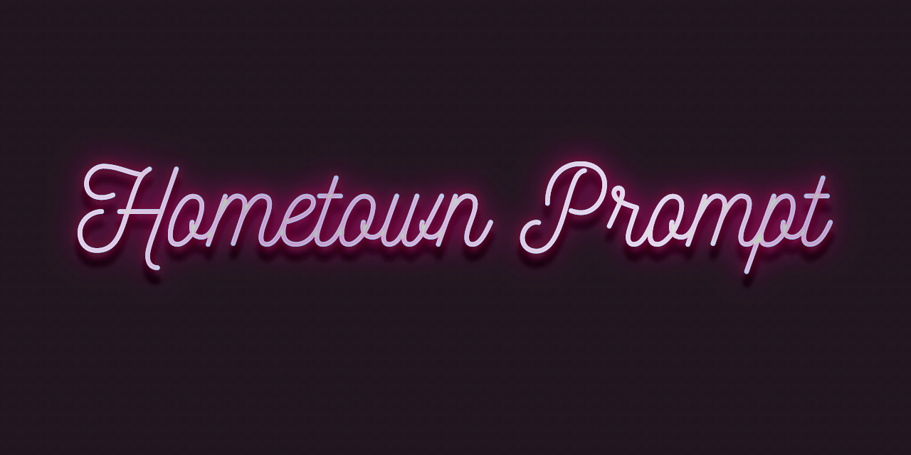

# Hometown Prompt

 



**Hometown is a feature rich, high performance Git-aware zsh theme** with segments for the user, host, time, the current working directory and its parent, and —within a Git repo— detailed Git status. It is carefully designed to show a lot of information clearly.

## Documentation

&nbsp;

📖 See the guide, including a web simulation demonstrating how the prompt responds to context and configuration, at https://hometown-prompt.olets.dev/

&nbsp;

## Screencast

Here's a screencast showing it in action, as a gif. Note that when you "accept" the command line (that is, hit <kbd>Enter</kbd>) the prompt trims down. You can view the same screencast as a video, with controls to pause, rewind, and fast forward, on the [Hometown docs site](https://hometown-prompt.olets.dev/).

<details><summary>Toggle to show/hide the screencast</summary>


</details>

<!-- DUPE hometown-prompt@v4 README.md hometown-prompt-docs@v4 docs/parts/screencast.md, zsh-transient-prompt@v1 docs/parts/screencast.md -->

<details><summary>Toggle to show/hide an annotated transcript</summary>

```shell
mkdir -p repo/child/grandchild/great-grandchild
cd repo

# cwd changes to current dir
# previous prompt simplifies: cwd has only one segment

git init

# cwd changes to underline Git repo root; Git branch and its appear

cd child

# cwd changes to current dir. segments start at repo root's parent

cd grandchild

# cwd changes as before
# previous prompt simplifies: cwd starts at the repo root

cd great-grandchild

# cwd changes. shows at most repo root's parent, repo root, ellipsis, cwd parent, cwd

git init

# cwd changes to underlined repo root, and parent

touch x y

# Git status changes

git add -A

# Git status changes, Git branch color changes

git commit -m first

# Git status changes, Git branch color changes

git switch -c feature

# Git branch changes, Git branch color changes

echo wip >> x

# Git status changes, Git branch color changes

git stash

# Git stash appears, Git status changes, Git branch color changes

echo a >> x

# Git status changes

rm y

# Git status changes

git add .

# Git status changes

git commit -m second

# Git status changes, Git branch color changes

git stash drop

# Git stash disappears

git switch main

# Git branch changes

echo b >> x

# Git status changes, Git branch color changes

git commit -am third

# Git status changes, Git branch color changes

git rebase @ feature

# Git HEAD changes, Git HEAD color changes, Git status changes, Git action appears, prompt character color changes

git checkout —ours x

# Git status changes, Git action appears, prompt character color changes

git add x

# Git HEAD changes, Git HEAD color changes, Git status changes, Git action appears

git rebase —continue —no-edit
```

</details>

## Appearance

By default it looks something like this. Time, current working directory, and Git ref info on the first line (using symbols, with inactive status data points hidden); Git file info on the second (using symbols, with disabled symbols for inactive status data points); and the prompt character on the third.


It has numerous layout and content toggles.

For example you can mix and match line break options, hidden/disabled options, and word/symbol options in any way you like.

With very little configuration it can look, for example, like this. Time, current working directory, Git ref info (using symbols, with inactive status data points hidden); and Git file info (using symbols, with inactive status data points hidden) on the first line; and the prompt character on the second.


Or like this. Time and current working directory on the first line; Git ref info (using words, with disabled symbols for inactive branch data points) on the second line; Git file info (using words, with inactive status data points hidden) on the third line; and the prompt character on the fourth.


You can also customize colors, text, symbols, and the slot which in these screenshots is the time. Here's just one of the infinite possibilities:


## Changelog

See the [CHANGELOG](CHANGELOG.md) file.

## Contributing

_Looking for the documentation site's source? See <https://github.com/olets/hometown-prompt-docs>_

Thanks for your interest. Contributions are welcome!

> Please note that this project is released with a [Contributor Code of Conduct](CODE_OF_CONDUCT.md). By participating in this project you agree to abide by its terms.

Check the [Issues](https://github.com/olets/hometown-prompt/issues) to see if your topic has been discussed before or if it is being worked on. You may also want to check the roadmap (see above).

Please read [CONTRIBUTING.md](CONTRIBUTING.md) before opening a pull request.

### Sponsoring

Love Hometown Prompt? I'm happy to be able to provide it for free. If you are moved to turn appreciation into action, I invite you to make a donation to one of the organizations listed below (to be listed as a financial contributor, send me a receipt via email or [Reddit DM](https://www.reddit.com/user/olets)). Thank you!

- [O‘ahu Water Protectors](https://oahuwaterprotectors.org/) a coalition of organizers and concerned community members fighting for safe, clean water on Oʻahu. Currently focused on the Red Hill Bulk Fuel Storage Facility crisis (see Sierra Club of Hawaii's [explainer](https://sierraclubhawaii.org/redhill)).
- [Hoʻoulu ʻĀina](https://hoouluaina.org/) is a 100-acre nature preserve nestled in the back of Kali hi valley on the island of Oʻahu which seeks to provide people of our ahupuaʻa and beyond the freedom to make connections and build meaningful relationships with the ʻāina, each other and ourselves.
- [Ol Pejeta Conservancy](https://www.olpejetaconservancy.org/) are caretakers of the land, safeguarding endangered species and ensuring the openness and accessibility of conservation for all. They empower their people to think the same way and embrace new approaches to conservation, and provide natural wilderness experiences, backed up by scientifically credible conservation and genuine interactions with wildlife.
- [Southern Utah Wilderness Alliance (SUWA)](https://suwa.org/) the only non-partisan, non-profit organization working full time to defend Utah’s redrock wilderness from oil and gas development, unnecessary road construction, rampant off-road vehicle use, and other threats to Utah’s wilderness-quality lands.

## License

<a href="https://www.github.com/olets/hometown-prompt">Hometown Prompt</a> by <a href="https://www.github.com/olets">Henry Bley-Vroman</a> is licensed under a license which is the unmodified text of <a href="https://creativecommons.org/licenses/by-nc-sa/4.0">CC BY-NC-SA 4.0</a> and the unmodified text of a <a href="https://firstdonoharm.dev/build?modules=eco,extr,media,mil,sv,usta">Hippocratic License 3</a>. It is not affiliated with Creative Commons or the Organization for Ethical Source.

Human-readable summary of (and not a substitute for) the [LICENSE](LICENSE) file:

You are free to

- Share — copy and redistribute the material in any medium or format
- Adapt — remix, transform, and build upon the material

Under the following terms

- Attribution — You must give appropriate credit, provide a link to the license, and indicate if changes were made. You may do so in any reasonable manner, but not in any way that suggests the licensor endorses you or your use.
- Non-commercial — You may not use the material for commercial purposes.
- Ethics - You must abide by the ethical standards specified in the Hippocratic License 3 with Ecocide, Extractive Industries, US Tariff Act, Mass Surveillance, Military Activities, and Media modules.
- Preserve terms — If you remix, transform, or build upon the material, you must distribute your contributions under the same license as the original.
- No additional restrictions — You may not apply legal terms or technological measures that legally restrict others from doing anything the license permits.

## Acknowledgments

- The human-readable license summary is based on https://creativecommons.org/licenses/by-nc-sa/4.0. The ethics point was added.
- Splash card font is [Nickainley](https://www.fontfabric.com/fonts/nickainley/) by Seniors Studio.
- See also [Git Prompt Kit](https://github.com/olets/git-prompt-kit#acknowledgments)'s acknowledgments.
