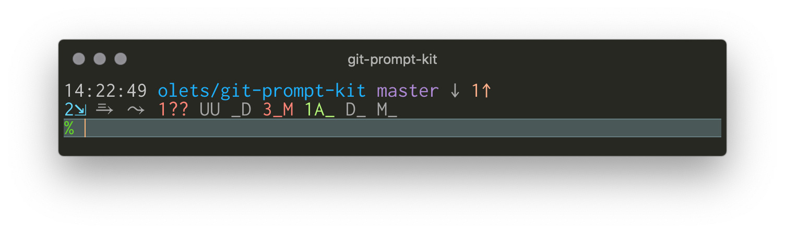
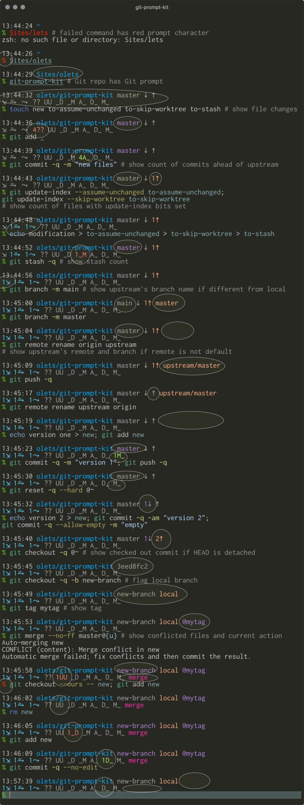

# Git Prompt Kit 

By default, Git Prompt Kit adds a prompt that includes the time, the current working directory, Git ref info, Git file info, and Git action info. It is very fast, thanks to gitstatus. Symbols, colors, under what conditions information is shown, and layout are configurable; the current working directory can be replaced with any content.

Have a different look in mind? Turn off Git Prompt Kit's default prompt, and instead use its components in your own fully custom one.



In the above screenshot, the default Git Prompt Kit prompt shows that `master` is checked out and that it is dirty, not behind the upstream, and one commit ahead of the upstream; that there are two stashes, no files with the assume-unchanged bit set, no files with the skip-worktree bit set, one untracked file, no conflicted files, no unstaged deleted files, three unstaged modified files, one staged new file, no staged deleted files, and no staged modified files; that the previous command succeeded; and, implicitly, that the upstream is `origin/master` and that there is no tag at `HEAD`.

&nbsp;

- [Installation](#installation)
- [Features](#features)
- [Options](#options)
- [Components](#components)
- [Performance](#performance)
- [Acknowledgments](#acknowledgments)
- [Contributing](#contributing)
- [License](#license)

&nbsp;

## Installation

### Package

Git Prompt Kit is available on Homebrew. Run

```
brew install olets/tap/git-prompt-kit
```

and follow the post-install instructions logged to the terminal.

### Plugin

Or install Git Prompt Kit with your favorite plugin manager (zinit is recommended for its superior performance).

- **[antibody](https://getantibody.github.io/)**: Add this to your plugins to your plugins file, and if you use static loading reload plugins.
  ```shell
  olets/git-prompt-kit
  ```

- **[Antigen](https://github.com/zsh-users/antigen)**: Add this to your `.zshrc`:
  ```shell
  antigen bundle olets/git-prompt-kit
  ```

- **[Oh-My-Zsh](https://github.com/robbyrussell/oh-my-zsh)**:

  - Clone to OMZ's plugins' directory:

    ```shell
    git clone https://github.com/olets/git-prompt-kit.git ${ZSH_CUSTOM:-~/.oh-my-zsh/custom}/plugins/git-prompt-kit
    ```

  - Add to the OMZ plugins array in your `.zshrc`:

    ```shell
    plugins=( [plugins...] git-prompt-kit)
    ```

- **[zgen](https://github.com/tarjoilija/zgen)**: add this to your `.zshrc`:
  ```shell
  zgen load olets/git-prompt-kit
  ```

- **[zinit](https://github.com/zdharma/zinit)** (formerly **zplugin**): add this to your `.zshrc`:
  ```shell
  zinit light olets/git-prompt-kit
  ```

- **[zplug](https://github.com/zplug/zplug)**: add this to your `.zshrc`:
  ```shell
  zplug "olets/git-prompt-kit"
  ```

### Prompt Manager

Git Prompt Kit comes with a [Spaceship](https://github.com/denysdovhan/spaceship-prompt) section definition, and it is easy to create a [Starship](https://starship.rs/) custom Git Prompt Kit-powered Git module. Instructions for both are in [Recipes.md](Recipes.md).

The Git Prompt Kit Spaceship section has been clocked at 50% faster than Spaceship's built in Git section. The Git Prompt Kit Starship module has been clocked at about 10% to 30% faster than Starship's built in Git module.

## Features

The following apply to the default prompt, and to the relevant components if used in a custom prompt.

- show the user if it isn't one of the hidden users
- show the host if it isn't one of the hidden hosts
- show the checked out branch, unless HEAD is detached in which case show the checked out commit
- dim the checked out branch or commit if the working tree is clean
- flag the checked out branch as local if it has no upstream
- show the number of commits behind and/or ahead of the upstream branch the local branch is
- show the checked out branch's upstream's remote and branch name if the remote is not `origin`
- show the checked out branch's upstream's branch name if different from the local name
- dim the stash count if zero
- dim the assumed-unchanged count if zero
- dim the skip-worktree count if zero
- show the working tree status (untracked, deleted count, modified count, untracked staged, deleted count staged, modified count staged) with `git status --porcelain` codes
- dim any working tree status codes for which the count is zero
- show the current action if there is one



## Options

Customize

- the colors
- the host symbol
- the default users
- the default hosts
- the Git symbols (for branch, commit, commits behind, commits ahead, stash, assumed-unchanged count, skip-worktree count, and file)
- the default Git remote
- the "custom" component's content
- whether to display zero-count commits-ahead and commits-behind components
- whether to display zero-count stash, assumed-unchanged, and skip-worktree components
- whether to display zero-count working tree components

### Options specific to the default prompt

Choose between

- a single-line prompt
- a two-line prompt with non-Git info, Git ref info (HEAD, commits behind/ahead, upstream, and tag) on first line and Git stashes, assume-unchanged, skip-worktree, files, and action on second (**default**)
- a two-line prompt all non-Git info on the first line and Git info on the second
- a three-line prompt with Git ref on the second line

Name | Type | Description | Default
---|---|---|---
`GIT_PROMPT_KIT_LINEBREAK_BEFORE_GIT_FILES` | number | Put the Git status info on the same line as the Git ref info? (YES if non-zero, NO if zero) | `1`
`GIT_PROMPT_KIT_NO_LINEBREAK_BEFORE_GIT_REF` | number | Put the Git ref info (HEAD, behind/ahead, upsteam, tag) on the same as he non-Git info? (YES if non-zero, NO if zero) | `1`
`GIT_PROMPT_KIT_SHOW_EXTENDED_STATUS` | number | Show the stash, assume-unchanged, and skip-worktree counts (YES if non-zero, NO if zero) | `1`

Set variables to in `.zshrc` before loading Git Prompt Kit. For example, to show a single-line prompt:

```shell
# ~/.zshrc
# --- snip ---
GIT_PROMPT_KIT_LINEBREAK_BEFORE_GIT_FILES=
zinit light olets/git-prompt-kit
```

### General

Name | Type | Description | Default
---|---|---|---
`GIT_PROMPT_KIT_8_BIT_FALLBACKS_FOR_24_BIT_COLORS` | number | Load `zsh/nearcolor`? (YES if non-zero, NO if zero) | `1`
`GIT_PROMPT_KIT_CUSTOM_CONTENT` | string | The code for the custom component* | `%2~`**
`GIT_PROMPT_KIT_DEFAULT_REMOTE` | string | The default Git remote | `origin`
`GIT_PROMPT_KIT_HIDE_TOOL_NAMES` | number | Do not show the word "Git" before the Git ref info? (YES if non-zero, NO if zero) | `1`
`GIT_PROMPT_KIT_HIDDEN_HOSTS` | array | The hosts that will not be included in the prompt | `()`
`GIT_PROMPT_KIT_HIDDEN_USERS` | array | The users that will not be included in the prompt | `()`
`GIT_PROMPT_KIT_LOCAL` | string | Shown if the checked-out branch has no upstream | `local`
`GIT_PROMPT_KIT_PROMPT_CHAR_NORMAL` | string | Character show at end of prompt for normal users | `%%` ***
`GIT_PROMPT_KIT_PROMPT_CHAR_ROOT` | string | Character show at end of prompt for root users | `#`
`GIT_PROMPT_KIT_SHOW_INACTIVE_AHEAD_BEHIND` | number | Show symbols for the commits behind/ahead of the upstream branch (dimmed) when the count is zero? (YES if non-zero, NO if zero) | `1`
`GIT_PROMPT_KIT_SHOW_INACTIVE_EXTENDED_STATUS` | number | Show Git stash, assumed-unchanged, and skip-worktree symbols (dimmed) when the count is zero? (YES if non-zero, NO if zero) | `1`
`GIT_PROMPT_KIT_SHOW_INACTIVE_STATUS` | number | Show Git status symbols (dimmed) when the count is zero? (YES if non-zero, NO if zero) | `1`
`GIT_PROMPT_KIT_USE_DEFAULT_PROMPT` | number | Use the default Git Prompt Kit prompt? (YES if non-zero, NO if zero) | `1`

Set variables in `.zshrc` before loading Git Prompt Kit. For example, to only show the user if _not_ `me`, only show the host if _not_ `my-computer` or `my-other-computer`, and use symbols to distinguish between branches and commits:

```shell
# ~/.zshrc
# --- snip ---
typeset -a GIT_PROMPT_KIT_HIDDEN_HOSTS=(my-computer my-other-computer)
typeset -a GIT_PROMPT_KIT_HIDDEN_USERS=(me)
GIT_PROMPT_KIT_SYMBOL_BRANCH="#"
GIT_PROMPT_KIT_SYMBOL_COMMIT="•"
zinit light olets/git-prompt-kit
```

\* For the special sequences supported in zsh prompts see http://zsh.sourceforge.net/Doc/Release/Prompt-Expansion.html

\** Current working directory and its parent, with `~` for initial `$HOME` (and with custom zsh "named directories" respected; see http://zsh.sourceforge.net/Doc/Release/Prompt-Expansion.html#Shell-state) (use `print -P <string>` to check a prompt string, e.g. `print -P "%2~"`).

\*** `%%` expands as `%` in the zsh prompt.

#### Symbols

By default, the symbol for the Git status (i.e. new, delete)

Name | Type | Description | Default
---|---|---|---
`GIT_PROMPT_KIT_SYMBOL_AHEAD` | string | Follows the Git commits-ahead count | `↑`
`GIT_PROMPT_KIT_SYMBOL_ASSUME_UNCHANGED` | string | Follows the Git assume-unchanged count | `⥱ `
`GIT_PROMPT_KIT_SYMBOL_BEHIND` | string | Follows the Git commits-behind count | `↓`
`GIT_PROMPT_KIT_SYMBOL_BRANCH` | string | Precedes the Git branch | `#`
`GIT_PROMPT_KIT_SYMBOL_COMMIT` | string | Precedes the Git commit | `•`
`GIT_PROMPT_KIT_SYMBOL_CONFLICTED` | string | Follows the Git both-modified count | `UU`
`GIT_PROMPT_KIT_SYMBOL_DELETED_STAGED` | string | Follows the Git unstaged deleted file count | `D_`
`GIT_PROMPT_KIT_SYMBOL_DELETED` | string | Follows the Git unstaged deleted file count | `_D`
`GIT_PROMPT_KIT_SYMBOL_HOST` | string | Precedes the host | `@`
`GIT_PROMPT_KIT_SYMBOL_MODIFIED_STAGED` | string | Follows the Git staged modified file count | `M_`
`GIT_PROMPT_KIT_SYMBOL_MODIFIED` | string | Follows the Git unstaged modified file count | `_M`
`GIT_PROMPT_KIT_SYMBOL_NEW` | string | Follows Git new file count | `A_`
`GIT_PROMPT_KIT_SYMBOL_SKIP_WORKTREE` | string | Follows the Git skip-worktree file count | `⤳ `
`GIT_PROMPT_KIT_SYMBOL_STASH` | string | Follows the Git stash count | `⇲`
`GIT_PROMPT_KIT_SYMBOL_TAG` | string | Follows the Git tag | `@`
`GIT_PROMPT_KIT_SYMBOL_UNTRACKED` | string | Follows Git untracked file count | `??`

#### Colors

Colors can be one of zsh's eight color names (`black`, `red`, `green`, `yellow`, `blue`, `magenta`, `cyan` and `white`; see http://zsh.sourceforge.net/Doc/Release/Zsh-Line-Editor.html#Character-Highlighting), an integer 1-255 for an 8-bit color (e.g. `199`; see https://en.wikipedia.org/wiki/ANSI_escape_code#8-bit), or a #-prefixed 3- or 6-character hexadecimal value for 24-bit color (e.g. `#fff`, `#34d5eb`).

For the following table but with swatches, see [Issue #1: README appendix: default colors' swatches](https://github.com/olets/git-prompt-kit/issues/1).

Name | Type | Description | Default
---|---|---|---
`GIT_PROMPT_KIT_COLOR_ACTION` | string | Color of the Git action | `199`
`GIT_PROMPT_KIT_COLOR_ASSUME_UNCHANGED` | string | Color of the Git assumed unchaged count | `81`
`GIT_PROMPT_KIT_COLOR_CUSTOM` | string | Color of the custom section (CWD in the default prompt) | `39`
`GIT_PROMPT_KIT_COLOR_FAILED` | string | Color of the prompt character when the previous command failed | `88`
`GIT_PROMPT_KIT_COLOR_HEAD` | string | Color of the Git HEAD and the commits-behind count | `140`
`GIT_PROMPT_KIT_COLOR_HOST` | string | Color of the host | `109`
`GIT_PROMPT_KIT_COLOR_INACTIVE` | string | Color of inactive sections | `247`
`GIT_PROMPT_KIT_COLOR_REMOTE` | string | Color of the Git remote and the commits-ahead count | `216`
`GIT_PROMPT_KIT_COLOR_SKIP_WORKTREE` | string | Color of the Git skip-worktree count | `81`
`GIT_PROMPT_KIT_COLOR_STAGED` | string | Color of Git staged file counts  | `120`
`GIT_PROMPT_KIT_COLOR_STASH` | string | Color of the Git stash count | `81`
`GIT_PROMPT_KIT_COLOR_SUCCEEDED` | string | Color of the prompt character when the previous command succeeded | `76`
`GIT_PROMPT_KIT_COLOR_TAG` | string | Color of Git tag | `86`
`GIT_PROMPT_KIT_COLOR_UNSTAGED` | string | Color of Git unstaged file counts | `162`
`GIT_PROMPT_KIT_COLOR_USER` | string | Color of the user | `109`

## Components

To use Git Prompt Kit's components in a custom prompt, set `GIT_PROMPT_KIT_USE_DEFAULT_PROMPT` to `0` before loading Git Prompt Kit, load Git Prompt Kit, and then refer to any of its components.

For example, for the prompt `<current working directory> [<Git HEAD> ]% `:

```shell
# ~/.zshrc
# --- snip ---
GIT_PROMPT_KIT_USE_DEFAULT_PROMPT=0
zinit light olets/git-prompt-kit
PROMPT='%1d ${GIT_PROMPT_KIT_HEAD:+$GIT_PROMPT_KIT_HEAD }%% '
```

Several complete recipes for building a [git-radar](https://github.com/michaeldfallen/git-radar)-like prompt, a [oh-my-git](https://github.com/arialdomartini/oh-my-git)-like prompt, [Pure](https://github.com/sindresorhus/pure)-like prompt, and a [Spaceship](https://github.com/denysdovhan/spaceship-prompt)-like high performance prompt from Git Prompt Kit components are provided in [Recipes.md](Recipes.md).

### Atoms

Name | Type | Description
---|---|---
`GIT_PROMPT_KIT_ACTION` | prompt string | Git current action (e.g. "rebase")
`GIT_PROMPT_KIT_AHEAD` | prompt string | Git commits-ahead-of-the-upstream count
`GIT_PROMPT_KIT_ASSUMED_UNCHANGED` | prompt string | Git assume-unchanged file count
`GIT_PROMPT_KIT_BEHIND` | prompt string | Git commits-behind-the-upstream count
`GIT_PROMPT_KIT_CHAR` | prompt string | Prompt character
`GIT_PROMPT_KIT_CONFLICTED` | prompt string | Git conflicted file count
`GIT_PROMPT_KIT_CUSTOM` | prompt string | Custom section (current working directory by default, see General Options)
`GIT_PROMPT_KIT_DELETED_STAGED` | prompt string | Git staged deleted file count
`GIT_PROMPT_KIT_DELETED` | prompt string | Git unstaged deleted file count
`GIT_PROMPT_KIT_HEAD` | prompt string | Git HEAD (branch or commit)
`GIT_PROMPT_KIT_MODIFIED_STAGED` | prompt string | Git staged modified file count
`GIT_PROMPT_KIT_MODIFIED` | prompt string | Git unstaged modified file count
`GIT_PROMPT_KIT_NEW` | prompt string | Git staged new file count
`GIT_PROMPT_KIT_SKIP_WORKTREE` | prompt string | Git skip-worktree file count
`GIT_PROMPT_KIT_STASHES` | prompt string | Git stash count
`GIT_PROMPT_KIT_TAG` | prompt string | Git tag at HEAD
`GIT_PROMPT_KIT_UNTRACKED` | prompt string | Git untracked file count
`GIT_PROMPT_KIT_UPSTREAM` | prompt string | Git upstream (branch or "local")
`GIT_PROMPT_KIT_USERHOST` | prompt string | User and host

### Molecules

Name | Type | Description
---|---|---
`GIT_PROMPT_KIT_REF` | prompt string | Git HEAD, commits behind count, commits ahead count, upstream, and tag as seen in the default prompt
`GIT_PROMPT_KIT_STATUS_EXTENDED` | prompt string | Git stash, assume-unchanged, and skip-worktree counts as seen in the default prompt
`GIT_PROMPT_KIT_STATUS` | prompt string | Git file status counts as seen in the default prompt

Additional variables that may be useful in custom prompts:

Name | Description
---|---
`GIT_PROMPT_KIT_DIRTY` | Equal to `1` if the Git worktree is dirty

## Performance

Git Prompt Kit is built on gitstatus. See [gitstatus's documentation](https://github.com/romkatv/gitstatus) for details on its performance and how it works.

Snapshot with macOS 10.14 on early-2015 MacBook Pro (2.9 GHz Intel Core i5, 16 GB 1867 MHz DDR3), zsh 5.3, zinit 3.1, iTerm2 3.3.9.

Adds about 50ms to the initial interactive session load time (time to first prompt after opening a new iTerm2 window), as measured by `zinit times` given

```shell
# zshrc
autoload -U add-zsh-hook
source "$HOME/.zinit/bin/zinit.zsh"
autoload -Uz _zinit
(( ${+_comps} )) && _comps[zinit]=_zinit
zinit light olets/git-prompt-kit
```

Git Prompt Kit has a roughly sub-10ms impact on time per prompt (time to draw new prompt after finishing previous command) in a non-Git directory _or_ a Git directory, regardless of `GIT_PROMPT_KIT_SET_PROMPT` value, as measured by comparing `zsh-prompt-benchmark` given

```shell
# zshrc
autoload -U add-zsh-hook
source "$HOME/.zinit/bin/zinit.zsh"
autoload -Uz _zinit
(( ${+_comps} )) && _comps[zinit]=_zinit
zinit light romkatv/zsh-prompt-benchmark
```

to `zsh-prompt-benchmark` given

```shell
# zshrc
autoload -U add-zsh-hook
source "$HOME/.zinit/bin/zinit.zsh"
autoload -Uz _zinit
(( ${+_comps} )) && _comps[zinit]=_zinit
zinit light romkatv/zsh-prompt-benchmark
zinit light olets/git-prompt-kit
```

## Acknowledgments

Git Prompt Kit is built on Roman Perepelitsa's [gitstatus](https://github.com/romkatv/gitstatus).

Showing "dimmed" components was inspired by Arialdo Martini's [oh-my-git](https://github.com/arialdomartini/oh-my-git), which leaves space for inactive symbols.

Using Git's short status format was inspired by Michael Allen's [git-radar](https://github.com/michaeldfallen/git-radar).

## Changelog

See the [CHANGELOG](CHANGELOG.md) file.

## Contributing

Thanks for your interest. Contributions are welcome!

> Please note that this project is released with a [Contributor Code of Conduct](CODE_OF_CONDUCT.md). By participating in this project you agree to abide by its terms.

Check the [Issues](https://github.com/olets/git-prompt-kit/issues) to see if your topic has been discussed before or if it is being worked on. You may also want to check the roadmap (see above). Discussing in an Issue before opening a Pull Request means future contributors only have to search in one place.

This project includes a Git [submodule](https://git-scm.com/book/en/v2/Git-Tools-Submodules). Passing `--recurse-submodules` when `git clone`ing is recommended.

This project loosely follows the [Angular commit message conventions](https://docs.google.com/document/d/1QrDFcIiPjSLDn3EL15IJygNPiHORgU1_OOAqWjiDU5Y/edit). This helps with searchability and with the changelog, which is generated automatically and touched up by hand only if necessary. Use the commit message format `<type>(<scope>): <subject>`, where `<type>` is **feat** for new or changed behavior, **fix** for fixes, **docs** for documentation, **style** for under the hood changes related to for example zshisms, **refactor** for other refactors, **test** for tests, or **chore** chore for general maintenance (this will be used primarily by maintainers not contributors, for example for version bumps). `<scope>` is more loosely defined. Look at the [commit history](https://github.com/olets/git-prompt-kit/commits/master) for ideas.

## License

This project is licensed under [MIT license](http://opensource.org/licenses/MIT).
For the full text of the license, see the [LICENSE](LICENSE) file.
