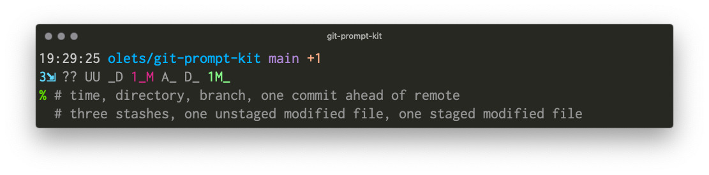

# Hometown Prompt 

**Hometown is a feature rich, high performance Git-aware zsh theme** with segments for the user, host, time, the current working directory and its parent, and detailed full Git status with in a Git repo. Get a feel for how the components respond to context and how the options work by playing with interactive demo at <a href="https://git-prompt-kit.netlify.app/">https://git-prompt-kit.netlify.app/</a>. With the default configuration it looks like

<figure>

<figcaption>
<pre>
19:29:25 olets/git-prompt-kit main +1
3⇲ ?? UU _D 1_M A_ D_ 1M_
% # time, directory, branch, one commit ahead of remote
  # three stashes, one unstaged modified file, one staged modified file
</pre>
</figcaption>
</figure>

<!-- TOC -->
- [Requirements](#requirements)
- [Installation](#installation)
    - [Homebrew](#homebrew)
    - [With a shell plugin manager](#with-a-shell-plugin-manager)
    - [Manual](#manual)
- [Usage](#usage)
    - [Examples](#examples)
    - [Options](#options)
- [Contributing](#contributing)
- [License](#License)

## Requirements

- Zsh

## Installation

Shell plugin manager is the recommended installation method.

### With a shell plugin manager

1. Install hometown-prompt with a zsh plugin manager. Each has their own way of doing things. See your package manager's documentation or the [zsh plugin manager plugin installation procedures gist](https://gist.github.com/olets/06009589d7887617e061481e22cf5a4a).

    After adding the plugin to the manager, restart zsh:

    ```shell
    exec zsh
    ```

### Manual

Either clone this repo and add `source path/to/hometown-prompt.zsh` to your `.zshrc`, or

1. Download [the latest `hometown-prompt` binary](https://github.com/olets/hometown-prompt/releases/latest)
1. Put the file `hometown-prompt` in a directory in your `PATH`

Then restart zsh:

```shell
exec zsh
```

## Usage

Once installed, open a new terminal. The theme will be Hometown!

### Examples

Try out Hometown at https://git-prompt-kit.netlify.app/.

Conceptually it is

```
<time> <CWD and parent> <branch or commit> <commits ahead> <commits behind> <upstream (branch if different name, remote and branch if not default remote, "local" if none)> <tag>
<stashes> <assumed-unchanged files> <skip-worktree files> <untracked files> <conflicted files> <deleted files> <modified files> <new files> <staged deleted files> <staged modified files> <action>
```

The `<CWD and parent>` segment can be replaced with any arbitrary content (see [Options](#options)).

In the above screenshot, the theme shows that

- `main` is checked out and dirty
- it is one commit ahead of the remote tracking branch
- there are three stashes, no untracked files, no conflicted files, no unstaged deleted files, one unstaged modified file, no staged new files, no staged deleted files, and one staged modified file
- the previous command succeeded, and that the user is not root
- and, implicitly, that
    - neither the user or host is unexpected,
    - the remote tracking branch is `origin/main`
    - the local branch is not behind it
    - there is no tag at `HEAD`
    - there are no files with the assume-unchanged bit set
    - there are no files with the skip-worktree bit set
    - and there is no action (e.g. merge, rebase, cherry-pick) underway.

### Options

Hometown uses Git Prompt Kit. See [Git Prompt Kit's Options](https://github.com/olets/git-prompt-kit#options) for the many customizations available.


## Performance

Hometown has a sub-10ms the time between prompts, as measured by [`zsh-prompt-benchmark`](https://github.com/romkatv/zsh-prompt-benchmark).

Hometown uses Git Prompt Kit. See [Git Prompt Kit](https://github.com/olets/git-prompt-kit) for performance details.

## Acknowledgments

Splash card font is [Nickainley](https://www.fontfabric.com/fonts/nickainley/) by Seniors Studio.

See [Git Prompt Kit's acknowledgments](https://github.com/olets/git-prompt-kit#acknowledgments) for more.

## Contributing

Thanks for your interest. Contributions are welcome!

> Please note that this project is released with a [Contributor Code of Conduct](CODE_OF_CONDUCT.md). By participating in this project you agree to abide by its terms.

Check the [Issues](https://github.com/olets/hometown-prompt/issues) to see if your topic has been discussed before or if it is being worked on.

Please read [CONTRIBUTING.md](CONTRIBUTING.md) before opening a pull request.

## License

<p xmlns:dct="http://purl.org/dc/terms/" xmlns:cc="http://creativecommons.org/ns#" class="license-text"><a rel="cc:attributionURL" property="dct:title" href="https://www.github.com/olets/hometown-prompt">hometown-prompt</a> by <a rel="cc:attributionURL dct:creator" property="cc:attributionName" href="https://www.github.com/olets">Henry Bley-Vroman</a> is licensed under <a rel="license" href="https://creativecommons.org/licenses/by-nc-sa/4.0">CC BY-NC-SA 4.0</a> plus <a href="https://firstdonoharm.dev/version/2/1/license.html">Hippocratic License 3</a>. Persons interested in using or adapting this work for commercial purposes should contact the author.</p>

   

For the full text of the license, see the [LICENSE](LICENSE) file.
