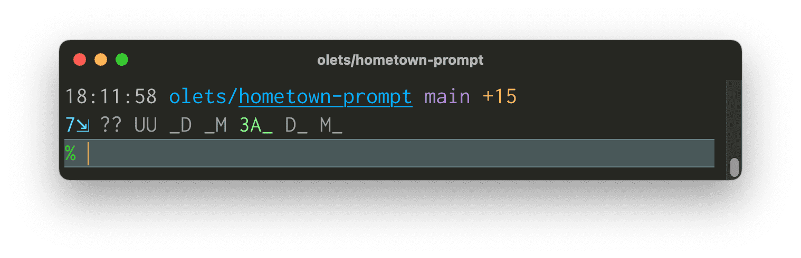
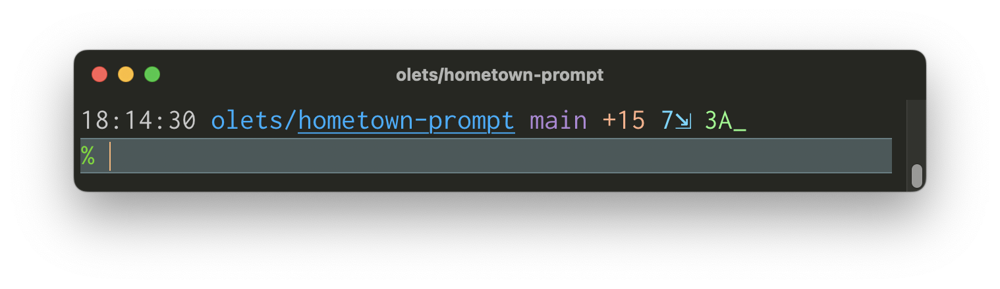

# Hometown Prompt  

**Hometown is a feature rich, high performance Git-centric zsh theme** with segments for the user, host, time, the current working directory and its parent, and —within a Git repo— detailed Git status. It is carefully designed to show dense information clearly.

## Documentation

&nbsp;

<!-- TODO drop `next.` -->
📖 See the guide, including a web simulation demonstrating how the prompt responds to context and configuration, at https://next.hometown-prompt.olets.dev/

&nbsp;

### How does it look?

You can customize symbols and colors, hide inactive segments, hide certain segments always, and choose how many lines the prompt takes up. Given your configuration, the content shown and the colors it's shown in changes based on which user is logged in, whether the previous command succeeded, and whether you're in a Git repo — and, if so, the Git status.

<!-- TODO drop `next.` -->
> Try It Out !  
> The best way to get a sense of Hometown Prompt, other than installing it, is to play with the  
> 🎨 [interactive web demo](https://next.hometown-prompt.olets.dev/demo.html) 🎨  

Here are three static examples to start with, using the default colors and default symbol sets. In each, Hometown Prompt is telling us that we're logged in as one of our usual users on one of our usual hosts, the user is not root, the previous command succeeded, the current directory is the Git repo `hometown-prompt`, the branch `main` is checked out, `main` pushes and pulls from `origin/main`, we're 15 commits ahead of the remote, there are seven stashes, and there are three untracked files.

Default (Git ref on first line, no inactive Git ref segments, no extended Git status, default symbols, inactive Git status segments visible)

More concise (inactive Git status segments hidden, active extended Git status segments visible, everything on one line)

Less concise (Git ref and status each on their own line, inactive Git ref segments visible, active extended Git status segments visible, inactive Git status segments hidden, verbose default symbols)

Or go completely custom! The colors and symbols can be anything you want.

> The window title in the screenshots above is thanks to [zsh-window-title](https://github.com/olets/zsh-window-title)

### What all is shown?

Always:

- The **current user**, if not one you've configured as hidden, and whether they are **root**
- The **current host**, if not one you've configured as hidden
- The **time** the prompt was drawn
- **User-configured content**
- The **current working directory** (the maximum number of path segments above the CWD is configurable)
- Whether the **previous command** succeeded

If in a Git repo:

- the **repo root directory, underlined** (the maximum number directories above the CWD is configurable)
- If in a subdirectory of the repo, the **subdirectory name** (the maximum number of directories listed between the Git root and the CWD is configurable)
- If HEAD is detached, the **checked out commit**. Text color is dependent on whether or not the index is dirty
- If a branch is checked out:
  - The name of the **checked out branch**. Text color is dependent on whether or not the index is dirty
  - If the checked out branch does not have a remote tracking branch, a symbol indicating that it is **local only**
  - If the checked out branch has an upstream (that is, [`@{upstream}`](https://www.git-scm.com/docs/gitrevisions#Documentation/gitrevisions.txt-emltbranchnamegtupstreamemegemmasterupstreamememuem)),
    - The number of **commits ahead of the upstream** the local branch is. Optionally show the indicator even if the local branch is not ahead of the upstream.
    - The number of **commits behind the upstream** the local branch is. Optionally show the indicator even if the local branch is not behind the upstream.
    - The **upstream's remote**, if different from the user-configured default
    - The **upstream's name**, if different from the local branch's
    - Text color is dependent on context and status:
      - If no distinct push remote, colored if the local is either ahead or behind
      - If there a distinct push remote, colored if the local is behind
  - If the checked out branch has a push remote (that is, [`@{push}`](https://www.git-scm.com/docs/gitrevisions#Documentation/gitrevisions.txt-emltbranchnamegtpushemegemmasterpushemempushem)) different from the upstream,
    - The number **commits ahead of the push remote** the local branch is. Optionally show the indicator even if the local branch is not ahead of the push remote.
    - The number **commits behind the push remote** the local branch is. Optionally show the indicator even if the local branch is not behind the push remote.
    - The **push remote's remote**, if different from the user-configured default
    - (The push branch's name is not shown, even if it differs from the local name. Want it to be? Weigh in at at [romkatv/gitstatus/#291](https://github.com/romkatv/gitstatus/issues/291))
- The first **tag** pointing to the current commit, if any
- The number of **untracked ("new") files**. Optionally show the accompanying symbol when there are no such files.
- The number of **conflicted files**. Optionally show the accompanying symbol when there are no such files.
- The number of **unstaged deleted files**. Optionally show the accompanying symbol when there are no such files.
- The number of **unstaged modified files**. Optionally show the accompanying symbol when there are no such files.
- The number of **staged new files**. Optionally show the accompanying symbol when there are no such files.
- The number of **staged deleted files**. Optionally show the accompanying symbol when there are no such files.
- The number of **staged modified files**. Optionally show the accompanying symbol when there are no such files.
- The name of the **ongoing action** (for example "rebase"), if any
- Optionally:
  - The **number of stashes**. Optionally show the accompanying symbol when there are no such files.
  - The **number of files with the assume-unchanged bit set**. Optionally show the accompanying symbol when there are no such files.
  - The **number of files with the skip-worktree bit set**. Optionally show the accompanying symbol when there are no such files.

## Changelog

See the [CHANGELOG](CHANGELOG.md) file.

## Contributing

_Looking for the documentation site's source? See <https://github.com/olets/hometown-prompt-docs>_

Thanks for your interest. Contributions are welcome!

> Please note that this project is released with a [Contributor Code of Conduct](CODE_OF_CONDUCT.md). By participating in this project you agree to abide by its terms.

Check the [Issues](https://github.com/olets/hometown-prompt/issues) to see if your topic has been discussed before or if it is being worked on. You may also want to check the roadmap (see above).

Please read [CONTRIBUTING.md](CONTRIBUTING.md) before opening a pull request.

### Sponsoring

Love Hometown Prompt? I'm happy to be able to provide it for free. If you are moved to turn appreciation into action, I invite you to make a donation to one of the organizations listed below (to be listed as a financial contributor, send me a receipt via email or [Reddit DM](https://www.reddit.com/user/olets)). Thank you!

- [O‘ahu Water Protectors](https://oahuwaterprotectors.org/) a coalition of organizers and concerned community members fighting for safe, clean water on Oʻahu. Currently focused on the Red Hill Bulk Fuel Storage Facility crisis (see Sierra Club of Hawaii's [explainer](https://sierraclubhawaii.org/redhill)).
- [Hoʻoulu ʻĀina](https://hoouluaina.org/) is a 100-acre nature preserve nestled in the back of Kali hi valley on the island of Oʻahu which seeks to provide people of our ahupuaʻa and beyond the freedom to make connections and build meaningful relationships with the ʻāina, each other and ourselves.
- [Ol Pejeta Conservancy](https://www.olpejetaconservancy.org/) are caretakers of the land, safeguarding endangered species and ensuring the openness and accessibility of conservation for all. They empower their people to think the same way and embrace new approaches to conservation, and provide natural wilderness experiences, backed up by scientifically credible conservation and genuine interactions with wildlife.
- [Southern Utah Wilderness Alliance (SUWA)](https://suwa.org/) the only non-partisan, non-profit organization working full time to defend Utah’s redrock wilderness from oil and gas development, unnecessary road construction, rampant off-road vehicle use, and other threats to Utah’s wilderness-quality lands.

## License

<a href="https://www.github.com/olets/hometown-prompt">Hometown Prompt</a> by <a href="https://www.github.com/olets">Henry Bley-Vroman</a> is licensed under a license which is the unmodified text of <a href="https://creativecommons.org/licenses/by-nc-sa/4.0">CC BY-NC-SA 4.0</a> and the unmodified text of a <a href="https://firstdonoharm.dev/build?modules=eco,extr,media,mil,sv,usta">Hippocratic License 3</a>. It is not affiliated with Creative Commons or the Organization for Ethical Source.

Human-readable summary of (and not a substitute for) the [LICENSE](LICENSE) file:

You are free to

- Share — copy and redistribute the material in any medium or format
- Adapt — remix, transform, and build upon the material

Under the following terms

- Attribution — You must give appropriate credit, provide a link to the license, and indicate if changes were made. You may do so in any reasonable manner, but not in any way that suggests the licensor endorses you or your use.
- Non-commercial — You may not use the material for commercial purposes.
- Ethics - You must abide by the ethical standards specified in the Hippocratic License 3 with Ecocide, Extractive Industries, US Tariff Act, Mass Surveillance, Military Activities, and Media modules.
- Preserve terms — If you remix, transform, or build upon the material, you must distribute your contributions under the same license as the original.
- No additional restrictions — You may not apply legal terms or technological measures that legally restrict others from doing anything the license permits.

## Acknowledgments

Splash card font is [Nickainley](https://www.fontfabric.com/fonts/nickainley/) by Seniors Studio.

Hometown Prompt is built out of [Git Prompt Kit components](https://github.com/olets/git-prompt-kit#acknowledgments).

The human-readable license summary is based on https://creativecommons.org/licenses/by-nc-sa/4.0. The ethics point was added.