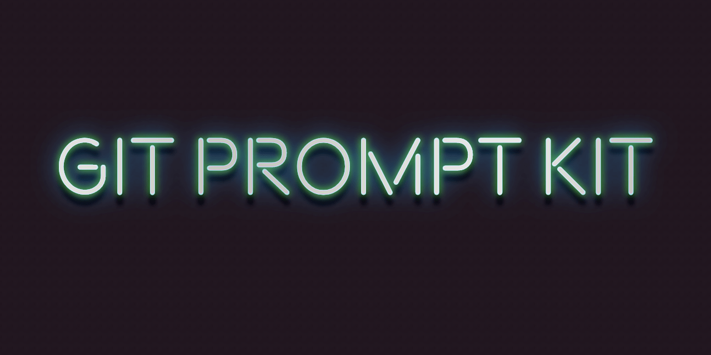

# Git Prompt Kit 

**Git Prompt Kit** is a configurable set of components for creating feature rich, high performance Git-aware zsh prompts (aka themes) with minimal coding. It is built on gitstatus, the same accelerated `git status` alternative used by Powerlevel10k.

Try the interactive demo! https://git-prompt-kit.netlify.app/

&nbsp;

- [Installation](#installation)
- [Default prompt](#default-prompt)
- [Options](#options)
- [Components](#components)
- [Performance](#performance)
- [Acknowledgments](#acknowledgments)
- [Changelog](#changelog)
- [Contributing](#contributing)
- [License](#license)

&nbsp;

## Installation

Shell plugin manager is the recommended installation method.

### With a shell plugin manager

1. Install git-prompt-kit with a zsh plugin manager. Each has their own way of doing things. See your package manager's documentation or the [zsh plugin manager plugin installation procedures gist](https://gist.github.com/olets/06009589d7887617e061481e22cf5a4a).

    After adding the plugin to the manager, restart zsh:

    ```shell
    exec zsh
    ```

### Manual

Either clone this repo and add `source path/to/git-prompt-kit.zsh` to your `.zshrc`, or

1. Download [the latest `git-prompt-kit` binary](https://github.com/olets/git-prompt-kit/releases/latest)
1. Put the file `git-prompt-kit` in a directory in your `PATH`

Then restart zsh:

```shell
exec zsh
```

### Prompt manager

You can use Git Prompt Kit to create a custom, high-performance Spaceship Git section or Starship Git module. Starting points for both are in [Recipes.md](Recipes.md).

The Git Prompt Kit Spaceship section has been clocked at 50% faster than Spaceship's own Git section. The Git Prompt Kit Starship module has been clocked at about 10% to 30% faster than Starship's own Git module.

## Examples

To get a feel for the components try the interactive demo: <a href="https://git-prompt-kit.netlify.app/">https://git-prompt-kit.netlify.app/</a>.

See [Recipes.md](Recipes.md) for code how to use Git Prompt Kit components to build a high-performance prompt styled after [git-radar](https://github.com/michaeldfallen/git-radar), [oh-my-git](https://github.com/arialdomartini/oh-my-git), [Pure](https://github.com/sindresorhus/pure), or [Spaceship](https://github.com/denysdovhan/spaceship-prompt).

[Hometown](https://github.com/olets/hometown-prompt) is a theme built entirely of Git Prompt Kit components.

## Options

Set variables in `.zshrc`. For example, to only show the user if _not_ `me`, only show the host if _not_ `my-computer` or `my-other-computer`, and use symbols to distinguish between branches and commits:

```shell
# ~/.zshrc
# --- snip ---
GIT_PROMPT_KIT_HIDDEN_HOSTS=( my-computer my-other-computer )
GIT_PROMPT_KIT_HIDDEN_USERS=( me )
GIT_PROMPT_KIT_SYMBOL_BRANCH="#"
GIT_PROMPT_KIT_SYMBOL_COMMIT="•"
# Load Git Prompt Kit (will differ depending on installation method)
```

To output your configuration, for example for sharing, run

```shell
git-prompt-kit-config
```

(The exporter makes an effort to get quoting right, but if you use a custom configuration with quotation marks it's worth double checking that the exported value is correct.)

### Behavior options

Name | Type | Description | Default
---|---|---|---
`GIT_PROMPT_KIT_HIDE_INACTIVE_AHEAD_BEHIND` | number | Hide dimmed symbols for the commits ahead of and commits behind the upstream branch when the count is zero? (HIDE if non-zero, SHOW if zero) | `1`
`GIT_PROMPT_KIT_HIDE_INACTIVE_EXTENDED_STATUS` | number | Hide dimmed Git stash, assumed-unchanged, and skip-worktree symbols when the count is zero? (HIDE if non-zero, SHOW if zero) | `1`
`GIT_PROMPT_KIT_HIDE_TOOL_NAMES` | number | Do not show the word "Git" before the Git ref info? (HIDE if non-zero, SHOW if zero) | `1`
`GIT_PROMPT_KIT_SHOW_INACTIVE_STATUS` | number | Show Git status symbols (dimmed) when the count is zero? (SHOW if non-zero, HIDE if zero) | `1`

### Color options

Colors can be

- one of zsh's eight color names (`black`, `red`, `green`, `yellow`, `blue`, `magenta`, `cyan` and `white`; see http://zsh.sourceforge.net/Doc/Release/Zsh-Line-Editor.html#Character-Highlighting)
- an integer 1-255 for an 8-bit color (see https://en.wikipedia.org/wiki/ANSI_escape_code#8-bit)
- or a #-prefixed 3- or 6-character hexadecimal value for 24-bit color (e.g. `#fff`, `#34d5eb`)

Support varies by terminal emulator.

> Tip: To check a color it can be useful to run `print -P %F{<color>}<text>%f`, for example `print -P %F{199}●%f`.

See [Issue #1: README appendix: default colors' swatches](https://github.com/olets/git-prompt-kit/issues/1) for the following table but with swatches. They may appear differently in your terminal. To visualize the configured colors in your terminal, run

```shell
git-prompt-kit-colors
```

Name | Type | Description | Default
---|---|---|---
`GIT_PROMPT_KIT_COLOR_ACTION` | string | Color of the Git action segment | `199`
`GIT_PROMPT_KIT_COLOR_ASSUME_UNCHANGED` | string | Color of the Git assumed unchaged files segment | `81`
`GIT_PROMPT_KIT_COLOR_FAILED` | string | Color of the prompt character when the previous command failed | `88`
`GIT_PROMPT_KIT_COLOR_HEAD` | string | Color of the Git HEAD segment when the working tree is dirty | `140`
`GIT_PROMPT_KIT_COLOR_HOST` | string | Color of the host segment | `109`
`GIT_PROMPT_KIT_COLOR_INACTIVE` | string | Color of inactive segments | `247`
`GIT_PROMPT_KIT_COLOR_PUSH_REMOTE` | string | Color of the Git push remote and its commits-ahead files segment | `111`
`GIT_PROMPT_KIT_COLOR_REMOTE` | string | Color of the Git remote and its commits-ahead files segment | `216`
`GIT_PROMPT_KIT_COLOR_SKIP_WORKTREE` | string | Color of the Git skip-worktree files segment | `81`
`GIT_PROMPT_KIT_COLOR_STAGED` | string | Color of Git staged files segment  | `120`
`GIT_PROMPT_KIT_COLOR_STASH` | string | Color of the Git stashes segment | `81`
`GIT_PROMPT_KIT_COLOR_SUCCEEDED` | string | Color of the prompt character when the previous command succeeded | `76`
`GIT_PROMPT_KIT_COLOR_TAG` | string | Color of Git tag segment | `86`
`GIT_PROMPT_KIT_COLOR_UNSTAGED` | string | Color of Git unstaged files segment | `162`
`GIT_PROMPT_KIT_COLOR_USER` | string | Color of the user | `109`
`GIT_PROMPT_KIT_COLOR_WORKDIR` | string | Color of the directory segment | `39`

### Content options

Name | Type | Description | Default
---|---|---|---
`GIT_PROMPT_KIT_CWD_TRAILING_COUNT` | integer | The maximum number of trailing path components in the current working directory component. When in a Git repository, this is relative to the Git root
`GIT_PROMPT_KIT_DEFAULT_PUSH_REMOTE_NAME` | string | The default Git push remote | `upstream`
`GIT_PROMPT_KIT_DEFAULT_REMOTE_NAME` | string | The default Git remote | `origin`
`GIT_PROMPT_KIT_HIDDEN_HOSTS` | array | The hosts that will not be included in the prompt | `()`
`GIT_PROMPT_KIT_HIDDEN_USERS` | array | The users that will not be included in the prompt | `()`
`GIT_PROMPT_KIT_LOCAL` | string | Shown if the checked-out branch has no upstream | `local`
`GIT_PROMPT_KIT_ROOT_TRAILING_COUNT` | integer | The maximum number of trailing path components in the Git root directory component * | `1`
`GIT_PROMPT_KIT_SHOW_EXTENDED_STATUS` | number | Show the stash, assume-unchanged, and skip-worktree counts (YES if non-zero, NO if zero) | `1`

### Layout options

"Git ref segment" is HEAD, commits ahead/behind, upstream, and tag.

Name | Type | Description | Default
---|---|---|---
`GIT_PROMPT_KIT_LINEBREAK_AFTER_GIT_REF` | number | _Do_ add a line break after the Git ref segment? (LINEBREAK if non-zero, NO LINEBREAK if zero) | `1`
`GIT_PROMPT_KIT_NO_LINEBREAK_BEFORE_GIT_REF` | number | Do _not_ add a line break before the Git ref segment? (NO LINEBREAK if non-zero, LINEBREAK if zero) | `1`

### Symbol options

The default symbols should work well in any font. The default Git file status symbols are [Git's own short format](https://git-scm.com/docs/git-status#_short_format) (underscore `_` represents column placement in `git-status --short`'s output).

Name | Type | Description | Default
---|---|---|---
`GIT_PROMPT_KIT_SYMBOL_AHEAD` | string | Precedes the Git commits-ahead segment | `+`
`GIT_PROMPT_KIT_SYMBOL_ASSUME_UNCHANGED` | string | Follows the Git assume-unchanged segment | `⥱ `
`GIT_PROMPT_KIT_SYMBOL_BEHIND` | string | Precedes the Git commits-behind segment | `-`
`GIT_PROMPT_KIT_SYMBOL_BRANCH` | string | Precedes the Git branch | none
`GIT_PROMPT_KIT_SYMBOL_CHAR_NORMAL` | string | Character shown at end of prompt for normal users | `%%` *
`GIT_PROMPT_KIT_SYMBOL_CHAR_ROOT` | string | Character shown at end of prompt for root users | `#`
`GIT_PROMPT_KIT_SYMBOL_COMMIT` | string | Precedes the Git commit | none
`GIT_PROMPT_KIT_SYMBOL_CONFLICTED` | string | Follows the Git conflicted files segment | `UU`
`GIT_PROMPT_KIT_SYMBOL_DELETED_STAGED` | string | Follows the Git unstaged deleted file segment | `D_`
`GIT_PROMPT_KIT_SYMBOL_DELETED` | string | Follows the Git unstaged deleted file segment | `_D`
`GIT_PROMPT_KIT_SYMBOL_HOST` | string | Precedes the host | `@`
`GIT_PROMPT_KIT_SYMBOL_MODIFIED_STAGED` | string | Follows the Git staged modified file segment | `M_`
`GIT_PROMPT_KIT_SYMBOL_MODIFIED` | string | Follows the Git unstaged modified file segment | `_M`
`GIT_PROMPT_KIT_SYMBOL_NEW` | string | Follows Git new file segment | `A_`
`GIT_PROMPT_KIT_SYMBOL_PUSH_REMOTE` | string | Precedes the Git push remote | `@{push}`
`GIT_PROMPT_KIT_SYMBOL_REMOTE` | string | Precedes the Git remote | `@{u}`
`GIT_PROMPT_KIT_SYMBOL_SKIP_WORKTREE` | string | Follows the Git skip-worktree file segment | `⤳ `
`GIT_PROMPT_KIT_SYMBOL_STASH` | string | Follows the Git stash segment | `⇲`
`GIT_PROMPT_KIT_SYMBOL_TAG` | string | Precedes the Git tag | `@`
`GIT_PROMPT_KIT_SYMBOL_UNTRACKED` | string | Follows Git untracked file segment | `??`

\* `%%` expands as `%` in the zsh prompt.

## Components

To use Git Prompt Kit's components in a custom prompt, load Git Prompt Kit and then refer to any of its components.

For example, to create the minimal prompt `<current working directory> [<Git HEAD> ]% `:

Minimal configuration, using Git Prompt Kit for the Git part only:

```shell
# ~/.zshrc
# --- snip ---
# Load Git Prompt Kit (will differ depending on installation method)
PROMPT='%1d ${GIT_PROMPT_KIT_HEAD:+$GIT_PROMPT_KIT_HEAD }%% '
```

Using Git Prompt Kit for everything

```shell
# ~/.zshrc
# --- snip ---
# Load Git Prompt Kit (will differ depending on installation method)
GIT_PROMPT_KIT_WORKDIR_DEPTH='2'
PROMPT='$GIT_PROMPT_KIT_WORKDIR ${GIT_PROMPT_KIT_HEAD:+$GIT_PROMPT_KIT_HEAD }$GIT_PROMPT_KIT_CHAR '
```

### Atom components

Name | Type | Description
---|---|---
`GIT_PROMPT_KIT_ACTION` | prompt string | Git: current action (e.g. "rebase")
`GIT_PROMPT_KIT_AHEAD` | prompt string | Git: commits ahead of the upstream
`GIT_PROMPT_KIT_ASSUMED_UNCHANGED` | prompt string | Git: assume-unchanged files count
`GIT_PROMPT_KIT_BEHIND` | prompt string | Git: commits behind the upstream
`GIT_PROMPT_KIT_CHAR` | prompt string | Prompt character
`GIT_PROMPT_KIT_CONFLICTED` | prompt string | Git: conflicted files count
`GIT_PROMPT_KIT_CWD` | prompt string | Current working directory with trailing directories. If in a Git repo, relative to the Git root.
`GIT_PROMPT_KIT_DELETED_STAGED` | prompt string | Git: staged deleted files count
`GIT_PROMPT_KIT_DELETED` | prompt string | Git: unstaged deleted files count
`GIT_PROMPT_KIT_HEAD` | prompt string | Git: HEAD (branch or commit)
`GIT_PROMPT_KIT_MODIFIED_STAGED` | prompt string | Git: staged modified files count
`GIT_PROMPT_KIT_MODIFIED` | prompt string | Git: unstaged modified files count
`GIT_PROMPT_KIT_NEW` | prompt string | Git: (staged) new files count
`GIT_PROMPT_KIT_PUSH_AHEAD` | prompt string | Git: commits ahead of the push remote
`GIT_PROMPT_KIT_PUSH_BEHIND` | prompt string | Git: commits behind the push remote
`GIT_PROMPT_KIT_PUSH` | prompt string | Git: push remote if not the default
`GIT_PROMPT_KIT_REMOTE` | prompt string | Git: "local" if no upstream; upstream branch if the name differs from the local branch; upstream remote and branch if the remote is not the default
`GIT_PROMPT_KIT_ROOT` | prompt string | Git root directory, underlined, with trailing directories.
`GIT_PROMPT_KIT_SKIP_WORKTREE` | prompt string | Git: skip-worktree files count
`GIT_PROMPT_KIT_STASHES` | prompt string | Git: stash count
`GIT_PROMPT_KIT_TAG` | prompt string | Git: up to one tag at HEAD
`GIT_PROMPT_KIT_UNTRACKED` | prompt string | Git: untracked (not staged) files count
`GIT_PROMPT_KIT_USERHOST` | prompt string | User (if not configured as hidden) and host (if not configured as hidden)

### Molecule components

Name | Type | Description
---|---|---
`GIT_PROMPT_KIT_REF` | prompt string | `GIT_PROMPT_KIT_HEAD`, `GIT_PROMPT_KIT_AHEAD`, `GIT_PROMPT_KIT_BEHIND`, `GIT_PROMPT_KIT_REMOTE`, `GIT_PROMPT_KIT_PUSH`, and `GIT_PROMPT_KIT_TAG`
`GIT_PROMPT_KIT_STATUS_EXTENDED` | prompt string | `GIT_PROMPT_KIT_STASHES`, `GIT_PROMPT_KIT_ASSUMED_UNCHANGED`, and `GIT_PROMPT_KIT_SKIP_WORKTREE`
`GIT_PROMPT_KIT_STATUS` | prompt string | `GIT_PROMPT_KIT_UNTRACKED`, `GIT_PROMPT_KIT_CONFLICTED`, `GIT_PROMPT_KIT_DELETED`, `GIT_PROMPT_KIT_MODIFIED`, `GIT_PROMPT_KIT_NEW`, `GIT_PROMPT_KIT_DELETED_STAGED`, and `GIT_PROMPT_KIT_MODIFIED_STAGED`
`GIT_PROMPT_KIT_WORKDIR` | prompt string | `GIT_PROMPT_KIT_ROOT` and `GIT_PROMPT_KIT_CWD`

### Other components

Name | Type | Description
---|---|---
`GIT_PROMPT_KIT_DIRTY` | number | Equal to `1` if the Git worktree is dirty

## Performance

Git Prompt Kit adds less than 10ms to the time between prompts, as measured by [`zsh-prompt-benchmark`](https://github.com/romkatv/zsh-prompt-benchmark). It is built on gitstatus, the same accelerated `git status` alternative used by Powerlevel10k. See [gitstatus](https://github.com/romkatv/gitstatus) for details.

## Acknowledgments

Git Prompt Kit is built on Roman Perepelitsa's [gitstatus](https://github.com/romkatv/gitstatus).

Showing "dimmed" components was inspired by Arialdo Martini's [oh-my-git](https://github.com/arialdomartini/oh-my-git), which leaves space for inactive symbols.

Using Git status's short format was inspired by Michael Allen's [git-radar](https://github.com/michaeldfallen/git-radar).

Splash card font is Beon by [Bastien Sozeau](http://sozoo.fr/).

## Changelog

See the [CHANGELOG](CHANGELOG.md) file.

## Contributing

Thanks for your interest. Contributions are welcome!

> Please note that this project is released with a [Contributor Code of Conduct](CODE_OF_CONDUCT.md). By participating in this project you agree to abide by its terms.

Check the [Issues](https://github.com/olets/git-prompt-kit/issues) to see if your topic has been discussed before or if it is being worked on.

Please read [CONTRIBUTING.md](CONTRIBUTING.md) before opening a pull request.

## License

<p xmlns:dct="http://purl.org/dc/terms/" xmlns:cc="http://creativecommons.org/ns#" class="license-text"><a rel="cc:attributionURL" property="dct:title" href="https://www.github.com/olets/git-prompt-kit">git-prompt-kit</a> by <a rel="cc:attributionURL dct:creator" property="cc:attributionName" href="https://www.github.com/olets">Henry Bley-Vroman</a> is licensed under <a rel="license" href="https://creativecommons.org/licenses/by-nc-sa/4.0">CC BY-NC-SA 4.0</a> plus <a href="https://firstdonoharm.dev/version/2/1/license.html">Hippocratic License 3</a>. Persons interested in using or adapting this work for commercial purposes should contact the author.</p>

   

For the full text of the license, see the [LICENSE](LICENSE) file.
