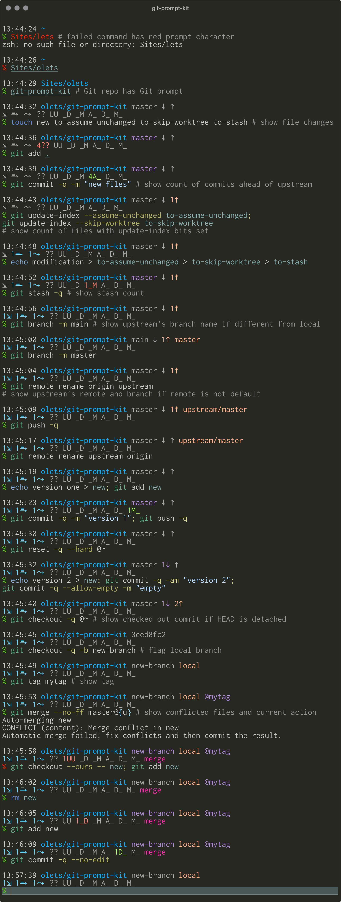

# Git Prompt Kit

Out of the box, Git Prompt Kit is an accelerated, heavily configurable Git-focused zsh prompt. The prompt-setting feature can be turned off and the individual components used to assemble a fully-custom prompt.


## Installation

### Package

zsh-abbr is available on Homebrew. Run

```
brew install olets/tap/git-prompt-kit
```

and follow the post-install instructions logged to the terminal.

### Plugin

Or install zsh-abbr with your favorite plugin manager (zinit is recommended for its superior performance)

- **[antibody](https://getantibody.github.io/)**: Add this to your plugins to your plugins file, and if you use static loading reload plugins.
  ```shell
  romkatv/gitstatus
	olets/git-prompt-kit
	```

- **[Antigen](https://github.com/zsh-users/antigen)**: Add this to your `.zshrc`:
  ```shell
  antigen bundle romkatv/gitstatus
  antigen bundle olets/git-prompt-kit
  ```

- **[Oh-My-Zsh](https://github.com/robbyrussell/oh-my-zsh)**:

  - Clone to OMZ's plugins' directory:

    ```shell
    git clone https://github.com/romkatv/gitstatus.git ${ZSH_CUSTOM:-~/.oh-my-zsh/custom}/plugins/gitstatus
    git clone https://github.com/olets/git-prompt-kit.git ${ZSH_CUSTOM:-~/.oh-my-zsh/custom}/plugins/git-prompt-kit
    ```

  - Add to the OMZ plugins array in your `.zshrc`:

    ```shell
    plugins=( [plugins...] gitstatus git-prompt-kit)
    ```

- **[zgen](https://github.com/tarjoilija/zgen)**: add this to your `.zshrc`:
  ```shell
  zgen load romkatv/gitstatus
  zgen load olets/git-prompt-kit
  ```

- **[zinit](https://github.com/zdharma/zinit)** (formerly **zplugin**): add this to your `.zshrc`:
  ```shell
  zinit light romkatv/gitstatus
	zinit light olets/git-prompt-kit
  ```

- **[zplug](https://github.com/zplug/zplug)**: add this to your `.zshrc`:
  ```shell
  zplug "romkatv/gitstatus"
	zplug "olets/git-prompt-kit"
	```

## Features

- show the user if it isn't the default user
- show the host if it isn't the default host
- show the checked out branch, unless HEAD is detached in which case show the checked out commit
- dim the checked out branch or commit if the working tree is clean
- flag the checked out branch as local if it has no upstream
- hide the behind and ahead components if HEAD is detached or has no upstream
- dim the behind and/or ahead components if not behind or ahead
- show the checked out branch's upstream's remote and branch name if the remote is not `origin`
- show the checked out branch's upstream's branch name if different from the local name
- dim the stash count if zero
- dim the assumed-unchanged count if zero
- dim the skip-worktree count if zero
- show the working tree status (untracked, deleted count, modified count, untracked staged, deleted count staged, modified count staged) with `git status --porcelain` codes
- dim any working tree status codes for which the count is zero
- show the current action if there is one



## Options

Customize

- the colors
- the host symbol
- the default user
- the default host
- the Git symbols (for branch, commit, commits behind, commits ahead, stash, assumed-unchanged count, skip-worktree count, and file)
- the default Git remote
- the "custom" component's content
- whether to display zero-count stash, assumed-unchanged, and skip-worktree components (independent of the option below)
- whether to display zero-count working tree components (independent of the option above)

### Options specific to the default prompt

Choose between

- a single-line prompt
- a two-line prompt with non-Git info, Git ref info (HEAD, commits behind/ahead, upstream, and tag(s)) on first line and Git stashes, assume-unchanged, skip-worktree, files, and action on second (**default**)
- a two-line prompt all non-Git info on the first line and Git info on the second
- a three-line prompt with Git ref on the second line

Name | Type | Description | Default
---|---|---|---
`GIT_PROMPT_KIT_GIT_REF_ON_NONGIT_LINE` | integer Boolean | Put the Git ref info (HEAD, behind/ahead, upsteam, tag(s)) on the same as he non-Git info? | `1`
`GIT_PROMPT_KIT_SHOW_EXTENDED_STATUS` | integer Boolean | Show the stash, assume-unchanged, and skip-worktree counts | 1
`GIT_PROMPT_KIT_GIT_STATUS_ON_OWN_LINE` | integer Boolean | Put the Git status info on the same line as the Git ref info? | `1`

Set variables in `.zshrc` before loading Git Prompt Kit. For example, to show a single-line prompt:

```shell
# ~/.zshrc
# --- snip ---
GIT_PROMPT_KIT_GIT_STATUS_ON_OWN_LINE=0
zinit light olets/git-prompt-kit
```

### General

Name | Type | Description | Default
---|---|---|---
`GIT_PROMPT_KIT_CUSTOM_CONTENT` | string | The code for the custom component* | `%2~`**
`GIT_PROMPT_KIT_DEFAULT_HOST` | string | The default host |
`GIT_PROMPT_KIT_DEFAULT_REMOTE` | string | The default Git remote | `origin`
`GIT_PROMPT_KIT_DEFAULT_USER` | string | The default user |
`GIT_PROMPT_KIT_HIDE_TOOL_NAMES` | integer Boolean | Do not show the word "Git" before the Git ref info? | `1`
`GIT_PROMPT_KIT_LOCAL` | string | Shown if the checked-out branch has no upstream | `local`
`GIT_PROMPT_KIT_PROMPT_CHAR_NORMAL` | string | Character show at end of prompt for normal users | `%%` ***
`GIT_PROMPT_KIT_PROMPT_CHAR_ROOT` | string | Character show at end of prompt for root users | `#`
`GIT_PROMPT_KIT_SHOW_INACTIVE_CONTEXT` | integer Boolean | Show dimmed Git stash, assumed-unchanged, and skip-worktree symbols? | `1`
`GIT_PROMPT_KIT_SHOW_INACTIVE_STATUS` | integer Boolean | Show dimmed Git status symbols? | `1`
`GIT_PROMPT_KIT_USE_DEFAULT_PROMPT` | integer Boolean | Use the default Git Prompt Kit prompt? | `1`

Set variables in `.zshrc` before loading Git Prompt Kit. For example, to only show the user if _not_ `me`, only show the host if _not_ `my-computer`, and use symbols to distinguish between branches and commits:

```shell
# ~/.zshrc
# --- snip ---
GIT_PROMPT_KIT_DEFAULT_HOST="my-computer"
GIT_PROMPT_KIT_DEFAULT_USER="me"
GIT_PROMPT_KIT_SYMBOL_BRANCH="#"
GIT_PROMPT_KIT_SYMBOL_COMMIT="•"
zinit light olets/git-prompt-kit
```

\* For the special sequences supported in zsh prompts see http://zsh.sourceforge.net/Doc/Release/Prompt-Expansion.html

\** Current working directory and its parent, with `~` for initial `$HOME` (and with custom zsh "named directories" respected; see http://zsh.sourceforge.net/Doc/Release/Prompt-Expansion.html#Shell-state).

\*** `%%` expands as `%` in the zsh prompt

#### Symbols

By default, the symbol for the Git status (i.e. new, delete)

Name | Type | Description | Default
---|---|---|---
`GIT_PROMPT_KIT_SYMBOL_AHEAD` | string | Follows the Git commits-ahead count | `↑`
`GIT_PROMPT_KIT_SYMBOL_ASSUME_UNCHANGED` | string | Follows the Git assume-unchanged count | `⥱ `
`GIT_PROMPT_KIT_SYMBOL_BEHIND` | string | Follows the Git commits-behind count | `↓`
`GIT_PROMPT_KIT_SYMBOL_BRANCH` | string | Precedes the Git branch | `#`
`GIT_PROMPT_KIT_SYMBOL_COMMIT` | string | Precedes the Git commit | `•`
`GIT_PROMPT_KIT_SYMBOL_CONFLICTED` | string | Follows the Git both-modified count | `UU`
`GIT_PROMPT_KIT_SYMBOL_DELETED_STAGED` | string | Follows the Git unstaged deleted file count | `D_`
`GIT_PROMPT_KIT_SYMBOL_DELETED` | string | Follows the Git unstaged deleted file count | `_D`
`GIT_PROMPT_KIT_SYMBOL_HOST` | string | Precedes the host | `@`
`GIT_PROMPT_KIT_SYMBOL_MODIFIED_STAGED` | string | Follows the Git staged modified file count | `M_`
`GIT_PROMPT_KIT_SYMBOL_MODIFIED` | string | Follows the Git unstaged modified file count | `_M`
`GIT_PROMPT_KIT_SYMBOL_NEW` | string | Follows Git new file count | `A_`
`GIT_PROMPT_KIT_SYMBOL_SKIP_WORKTREE` | string | Follows the Git skip-worktree file count | `⤳ `
`GIT_PROMPT_KIT_SYMBOL_STASH` | string | Follows the Git stash count | `⇲`
`GIT_PROMPT_KIT_SYMBOL_TAG` | string | Follows the Git tag(s) | `@`
`GIT_PROMPT_KIT_SYMBOL_UNTRACKED` | string | Follows Git untracked file count | `??`

Set variables in `.zshrc` before loading Git Prompt Kit. For example, to only show the user if _not_ `me`:

```shell
# ~/.zshrc
# --- snip ---
GIT_PROMPT_KIT_DEFAULT_HOST="my-computer"
GIT_PROMPT_KIT_DEFAULT_USER="me"
zinit light olets/git-prompt-kit
```

#### Colors

Colors can be one of zsh's eight color names (`black`, `red`, `green`, `yellow`, `blue`, `magenta`, `cyan` and `white`; see http://zsh.sourceforge.net/Doc/Release/Zsh-Line-Editor.html#Character-Highlighting), an integer 1-255 for an 8-bit color (e.g. `199`; see https://en.wikipedia.org/wiki/ANSI_escape_code#8-bit), or a #-prefixed 3- or 6-character hexadecimal value for 24-bit color (e.g. `#fff`, `#34d5eb`).

If using _hexadecimal_ values across terminal emulators that may or may not support 24-bit color, add

```shell
[[ $COLORTERM = *(24bit|truecolor)* ]] || zmodload zsh/nearcolor
```

before setting the colors (see http://zsh.sourceforge.net/Doc/Release/Zsh-Modules.html#The-zsh_002fnearcolor-Module).

Name | Type | Description | Default
---|---|---|---
`GIT_PROMPT_KIT_COLOR_ACTION` | string | Color of the Git action | `199` (8-bit equivalent of `#ff00af`)
`GIT_PROMPT_KIT_COLOR_ASSUME_UNCHANGED` | string | Color of the Git assumed unchaged count | `81` (8-bit equivalent of `#5fd7ff`)
`GIT_PROMPT_KIT_COLOR_CUSTOM` | string | Color of the custom section (CWD in the default prompt) | `39` (8-bit equivalent of `#00afff`)
`GIT_PROMPT_KIT_COLOR_FAILED` | string | Color of the prompt character when the previous command failed | `196` (8-bit equivalent of `#ff0000`)
`GIT_PROMPT_KIT_COLOR_HEAD` | string | Color of the Git HEAD and the commits-behind count | `140` (8-bit equivalent of `#af87d7`)
`GIT_PROMPT_KIT_COLOR_HOST` | string | Color of the host | `109` (8-bit equivalent of `#87afaf`)
`GIT_PROMPT_KIT_COLOR_INACTIVE` | string | Color of inactive sections | `248` (8-bit equivalent of `#a8a8a8`)
`GIT_PROMPT_KIT_COLOR_REMOTE` | string | Color of the Git remote and the commits-ahead count | `216` (8-bit equivalent of `#ffaf87`)
`GIT_PROMPT_KIT_COLOR_SKIP_WORKTREE` | string | Color of the Git skip-worktree count | `81` (8-bit equivalent of `#5fd7ff`)
`GIT_PROMPT_KIT_COLOR_STAGED` | string | Color of Git staged file counts  | `2` (8-bit equivalent of `#008000`)
`GIT_PROMPT_KIT_COLOR_STASH` | string | Color of the Git stash count | `81` (8-bit equivalent of `#5fd7ff`)
`GIT_PROMPT_KIT_COLOR_SUCCEEDED` | string | Color of the prompt character when the previous command succeeded | `76` (8-bit equivalent of `#5fd700`)
`GIT_PROMPT_KIT_COLOR_TAG` | string | Color of Git tags | `140` (8-bit equivalent of `#af87d7`)
`GIT_PROMPT_KIT_COLOR_UNSTAGED` | string | Color of Git unstaged file counts | `1` (8-bit equivalent of `#800000`)
`GIT_PROMPT_KIT_COLOR_USER` | string | Color of the user | `109` (8-bit equivalent of `#87afaf`)

## Components

To use Git Prompt Kit's components in a custom prompt, set `GIT_PROMPT_KIT_USE_DEFAULT_PROMPT` to `0` before loading Git Prompt Kit, load Git Prompt Kit, and then refer to any of its components.

For example, for the prompt `<current working directory> [<Git HEAD> ]% `:

```shell
# ~/.zshrc
# --- snip ---
GIT_PROMPT_KIT_USE_DEFAULT_PROMPT=0
zinit light olets/git-prompt-kit
PROMPT='%1d ${GIT_PROMPT_KIT_HEAD:+$GIT_PROMPT_KIT_HEAD }%% '
```

Several complete recipes for building a [git-radar](https://github.com/michaeldfallen/git-radar)-like prompt, a [oh-my-git](https://github.com/arialdomartini/oh-my-git)-like prompt, [Pure](https://github.com/sindresorhus/pure)-like prompt, and a [Spaceship](https://github.com/denysdovhan/spaceship-prompt)-like high performance prompt from Git Prompt Kit components are provided in [Recipes.md](Recipes.md).

### Atoms

Name | Type | Description
---|---|---
`GIT_PROMPT_KIT_ACTION` | prompt string | Git current action (e.g. "rebase")
`GIT_PROMPT_KIT_AHEAD` | prompt string | Git commits-ahead-of-the-upstream count
`GIT_PROMPT_KIT_ASSUMED_UNCHANGED` | prompt string | Git assume-unchanged file count
`GIT_PROMPT_KIT_BEHIND` | prompt string | Git commits-behind-the-upstream count
`GIT_PROMPT_KIT_CHAR` | prompt string | Prompt character
`GIT_PROMPT_KIT_CONFLICTED` | prompt string | Git conflicted file count
`GIT_PROMPT_KIT_CUSTOM` | prompt string | Custom section (current working directory by default, see General Options)
`GIT_PROMPT_KIT_DELETED_STAGED` | prompt string | Git staged deleted file count
`GIT_PROMPT_KIT_DELETED` | prompt string | Git unstaged deleted file count
`GIT_PROMPT_KIT_HEAD` | prompt string | Git HEAD (branch or commit)
`GIT_PROMPT_KIT_MODIFIED_STAGED` | prompt string | Git staged modified file count
`GIT_PROMPT_KIT_MODIFIED` | prompt string | Git unstaged modified file count
`GIT_PROMPT_KIT_NEW` | prompt string | Git staged new file count
`GIT_PROMPT_KIT_SKIP_WORKTREE` | prompt string | Git skip-worktree file count
`GIT_PROMPT_KIT_STASHES` | prompt string | Git stash count
`GIT_PROMPT_KIT_TAG` | prompt string | Git tag(s) at HEAD
`GIT_PROMPT_KIT_UNTRACKED` | prompt string | Git untracked file count
`GIT_PROMPT_KIT_UPSTREAM` | prompt string | Git upstream (branch or "local")
`GIT_PROMPT_KIT_USERHOST` | prompt string | User and host

### Molecules

Name | Type | Description
---|---|---
`GIT_PROMPT_KIT_REF` | prompt string | Git HEAD, commits behind count, commits ahead count, upstream, and tag as seen in the default prompt
`GIT_PROMPT_KIT_STATUS_EXTENDED` | prompt string | Git stash, assume-unchanged, and skip-worktree counts as seen in the default prompt
`GIT_PROMPT_KIT_STATUS` | prompt string | Git file status counts as seen in the default prompt

Additional variables that may be useful in custom prompts:

Name | Description
---|---
`GIT_PROMPT_KIT_DIRTY` | Equal to `1` if the Git worktree is dirty

## Performance

Snapshot with macOS 10.14 on early-2015 MacBook Pro (2.9 GHz Intel Core i5, 16 GB 1867 MHz DDR3), zsh 5.3, zinit 3.1, iTerm2 3.3.9.

Adds about 50ms to the initial interactive session load time (time to first prompt after opening a new iTerm2 window), as measured by `zinit times` given

```shell
# zshrc
autoload -U add-zsh-hook
source "$HOME/.zinit/bin/zinit.zsh"
autoload -Uz _zinit
(( ${+_comps} )) && _comps[zinit]=_zinit
zinit light romkatv/gitstatus
zinit light olets/git-prompt-kit
```

Git Prompt Kit has a roughly sub-10ms impact on time per prompt (time to draw new prompt after finishing previous command) in a non-Git directory _or_ a Git directory, regardless of `GIT_PROMPT_KIT_SET_PROMPT` value, as measured by comparing `zsh-prompt-benchmark` given

```shell
# zshrc
autoload -U add-zsh-hook
source "$HOME/.zinit/bin/zinit.zsh"
autoload -Uz _zinit
(( ${+_comps} )) && _comps[zinit]=_zinit
zinit light romkatv/zsh-prompt-benchmark
```

to `zsh-prompt-benchmark` given

```shell
# zshrc
autoload -U add-zsh-hook
source "$HOME/.zinit/bin/zinit.zsh"
autoload -Uz _zinit
(( ${+_comps} )) && _comps[zinit]=_zinit
zinit light romkatv/zsh-prompt-benchmark
zinit light romkatv/gitstatus
zinit light olets/git-prompt-kit
```

## Acknowledgments

Git Prompt Kit relies on Roman Perepelitsa's [gitstatus](https://github.com/romkatv/gitstatus).

Showing "dimmed" components was inspired by Arialdo Martini's [oh-my-git](https://github.com/arialdomartini/oh-my-git), which leaves space for inactive symbols.

Using Git's short status format was inspired by Michael Allen's [git-radar](https://github.com/michaeldfallen/git-radar).
