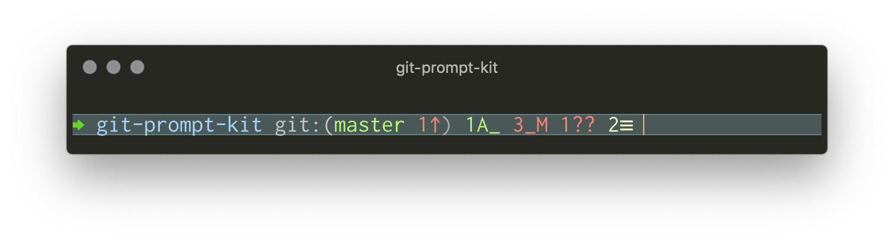
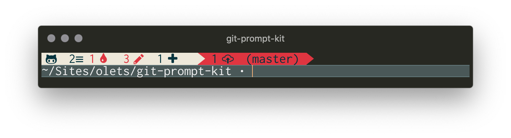
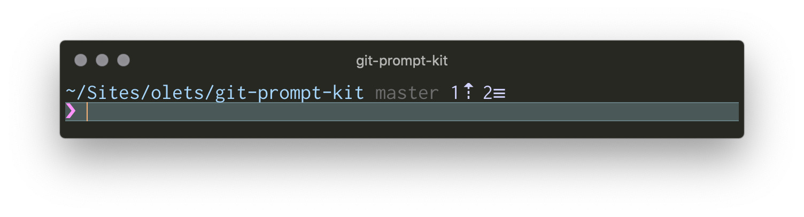

# Recipes

- [Prompt Managers](#prompt-managers)
- [Customization examples](#customization-examples)

## Prompt Managers

### Spaceship

Git Prompt Kit comes with a [Spaceship](https://github.com/denysdovhan/spaceship-prompt) section. The Git Prompt Kit Spaceship section loads about in about 1/2 the time Spaceship's built in Git section takes. Add Git Prompt Kit to your zshrc as above (Homebrew, plugin, or manual). Also add `git-prompt-kit.spaceship.zsh`. Then add `git_prompt_kit` to `SPACESHIP_PROMPT_ORDER`.

The Git Prompt Kit Spaceship section uses the default Git Prompt Kit's Git components; that is, it does not include Git Prompt Kit's user, host, the custom section, or prompt character components.

```shell
# .zshrc

# Configure Spaceship
SPACESHIP_PROMPT_ORDER=(
  # any other sections
  git_prompt_kit
  # any other sections
)

# Configure Git Prompt Kit
GIT_PROMPT_KIT_USE_DEFAULT_PROMPT=0
# and any git-prompt-kit config options
# For example, a compact prompt to fit nicely with other sections:
GIT_PROMPT_KIT_SHOW_INACTIVE_AHEAD_BEHIND=0
GIT_PROMPT_KIT_SHOW_INACTIVE_EXTENDED_STATUS=0
GIT_PROMPT_KIT_SHOW_INACTIVE_STATUS=0
GIT_PROMPT_KIT_USE_DEFAULT_PROMPT=0

# Use Git Prompt Kit and Spaceship
# Will vary by your installation method. For example with zinit:
zinit ice src"git-prompt-kit.spaceship.zsh"
zinit light /Users/home/Sites/olets/git-prompt-kit
zinit light "denysdovhan/spaceship-prompt"
```

See <https://github.com/denysdovhan/spaceship-prompt/blob/master/docs/Options.md#order> for Spaceship's default order.

### Starship

You can use Git Prompt Kit with [Starship](https://starship.rs/). The Git Prompt Kit Starship module loads in about 9/10 the time Starship's built in Git module takes.

```shell
# shell rc file

# Configure Git Prompt Kit
GIT_PROMPT_KIT_LINEBREAK_BEFORE_GIT_FILES=0
# and any git-prompt-kit config options.
# For example, a compact prompt to fit nicely with other modules:
GIT_PROMPT_KIT_SHOW_INACTIVE_AHEAD_BEHIND=0
GIT_PROMPT_KIT_SHOW_INACTIVE_EXTENDED_STATUS=0
GIT_PROMPT_KIT_SHOW_INACTIVE_STATUS=0
GIT_PROMPT_KIT_USE_DEFAULT_PROMPT=0

# Use Git Prompt Kit and Spaceship
# Will vary by your installation method. For example on zsh with zinit:
zinit light /Users/home/Sites/olets/git-prompt-kit
eval "$(starship init zsh)"
```

```toml
# starship.toml

[git_branch]
disabled = true

[git_commit]
disabled = true

[git_state]
disabled = true

[git_status]
disabled = true

[custom.git_prompt_kit]
# Customize to your liking. For example, here is
# ref, extended status, status, and action, space-separated
command = "print -P '$GIT_PROMPT_KIT_REF$GIT_PROMPT_KIT_STATUS_EXTENDED${GIT_PROMPT_KIT_STATUS_EXTENDED:+${${GIT_PROMPT_KIT_STATUS:+ }:-${GIT_PROMPT_KIT_ACTION:+ }}}$GIT_PROMPT_KIT_STATUS${GIT_PROMPT_KIT_ACTION:+${GIT_PROMPT_KIT_STATUS:+ }}$GIT_PROMPT_KIT_ACTION'"
shell = ["zsh"]
when = "true"
prefix = ""
```

See <https://starship.rs/config/#prompt> for Starship's default order.

To show the Git Prompt Kit default prompt's Git prompt (as with the Spaceship section above), use

```toml
command = "print -P '$GIT_PROMPT_KIT_REF${GIT_PROMPT_KIT_HEAD:+${${GIT_PROMPT_KIT_LINEBREAK_BEFORE_GIT_FILES:+\n}:- }}${GIT_PROMPT_KIT_SHOW_EXTENDED_STATUS:+$GIT_PROMPT_KIT_STATUS_EXTENDED}${${GIT_PROMPT_KIT_SHOW_EXTENDED_STATUS:+$GIT_PROMPT_KIT_STATUS_EXTENDED}:+${${GIT_PROMPT_KIT_STATUS:-$GIT_PROMPT_KIT_ACTION}:+ }}$GIT_PROMPT_KIT_STATUS${GIT_PROMPT_KIT_STATUS:+${GIT_PROMPT_KIT_ACTION:+ }}$GIT_PROMPT_KIT_ACTION'"
```

## Customization examples

Here are some examples of how the Git Prompt Kit components can be used.

They have not been thoroughly battle tested — they are not "Git Prompt Kit themes" but rather starting points for those new to customizing the zsh prompt.

The construct `${x:+y}` is 'print y if $x is not null' (`${x:-y}` is 'print y if $x is null'). In the context of prompt building, it is useful to conditionally add spaces: `${x:+$x }` is 'print "$x " if $x is not null'.

- [git-radar-like](#git-radar-like)
- [oh-my-git-like](#oh-my-git-like)
- [Pure-like](#pure-like)
- [Spaceship-like](#Spaceship-like)

---

### [git-radar](https://github.com/michaeldfallen/git-radar)-like



```shell
# ~/.zshrc
# --- snip ---
# Configure Git Prompt Kit
GIT_PROMPT_KIT_COLOR_ACTION=yellow
GIT_PROMPT_KIT_COLOR_ASSUME_UNCHANGED=yellow
GIT_PROMPT_KIT_COLOR_CUSTOM=blue
GIT_PROMPT_KIT_COLOR_HEAD=green
GIT_PROMPT_KIT_COLOR_REMOTE=red
GIT_PROMPT_KIT_COLOR_SKIP_WORKTREE=yellow
GIT_PROMPT_KIT_COLOR_STAGED=green
GIT_PROMPT_KIT_COLOR_STASH=yellow
GIT_PROMPT_KIT_COLOR_UNSTAGED=red
GIT_PROMPT_KIT_CUSTOM_CONTENT=%1~
GIT_PROMPT_KIT_GIT_STATUS_ON_OWN_LINE=0
GIT_PROMPT_KIT_PROMPT_CHAR_NORMAL=⮕
GIT_PROMPT_KIT_SHOW_INACTIVE_CONTEXT=0
GIT_PROMPT_KIT_SHOW_INACTIVE_STATUS=0
GIT_PROMPT_KIT_SYMBOL_STASH=≡
GIT_PROMPT_KIT_USE_DEFAULT_PROMPT=0

# Load gitstatus and Git Prompt Kit (will differ depending on installation method)

zinit light romkatv/gitstatus
zinit light olets/git-prompt-kit

# Build prompt
PROMPT=
PROMPT+=$'\n'
PROMPT+='$GIT_PROMPT_KIT_CHAR '
PROMPT+='$GIT_PROMPT_KIT_CUSTOM '
PROMPT+='${GIT_PROMPT_KIT_HEAD:+git:($GIT_PROMPT_KIT_HEAD}'
PROMPT+='${GIT_PROMPT_KIT_ACTION:+ $GIT_PROMPT_KIT_ACTION}'
PROMPT+='${GIT_PROMPT_KIT_BEHIND:+ $GIT_PROMPT_KIT_BEHIND}'
PROMPT+='${GIT_PROMPT_KIT_AHEAD:+ $GIT_PROMPT_KIT_AHEAD}'
PROMPT+='${GIT_PROMPT_KIT_UPSTREAM:+ $GIT_PROMPT_KIT_UPSTREAM}'
PROMPT+='${GIT_PROMPT_KIT_HEAD:+) }'
PROMPT+='${GIT_PROMPT_KIT_DELETED_STAGED:+$GIT_PROMPT_KIT_DELETED_STAGED }'
PROMPT+='${GIT_PROMPT_KIT_MODIFIED_STAGED:+$GIT_PROMPT_KIT_MODIFIED_STAGED }'
PROMPT+='${GIT_PROMPT_KIT_NEW:+$GIT_PROMPT_KIT_NEW }'
PROMPT+='${GIT_PROMPT_KIT_DELETED:+$GIT_PROMPT_KIT_DELETED }'
PROMPT+='${GIT_PROMPT_KIT_MODIFIED:+$GIT_PROMPT_KIT_MODIFIED }'
PROMPT+='${GIT_PROMPT_KIT_CONFLICTED:+$GIT_PROMPT_KIT_CONFLICTED }'
PROMPT+='${GIT_PROMPT_KIT_UNTRACKED:+$GIT_PROMPT_KIT_UNTRACKED }'
PROMPT+='${GIT_PROMPT_KIT_STATUS_EXTENDED:+$GIT_PROMPT_KIT_STATUS_EXTENDED }'
```

### [oh-my-git](https://github.com/arialdomartini/oh-my-git)-like

omg's oppa-lana-style. Requires a Font Awesome-patched font, see https://github.com/gabrielelana/awesome-terminal-fonts/tree/patching-strategy/patched



```shell
# ~/.zshrc
# --- snip ---
# Configure Git Prompt Kit
[[ $COLORTERM = *(24bit|truecolor)* ]] || zmodload zsh/nearcolor

GIT_PROMPT_KIT_COLOR_ASSUME_UNCHANGED="#03343f"
GIT_PROMPT_KIT_COLOR_CUSTOM="white"
GIT_PROMPT_KIT_COLOR_HEAD="#03343f"
GIT_PROMPT_KIT_COLOR_INACTIVE="#eee8d9"
GIT_PROMPT_KIT_COLOR_REMOTE="#03343f"
GIT_PROMPT_KIT_COLOR_SKIP_WORKTREE="#03343f"
GIT_PROMPT_KIT_COLOR_STAGED="#03343f"
GIT_PROMPT_KIT_COLOR_STASH="#03343f"
GIT_PROMPT_KIT_COLOR_SUCCEEDED="white"
GIT_PROMPT_KIT_COLOR_TAG="#03343f"
GIT_PROMPT_KIT_COLOR_UNSTAGED="#e0323b"
GIT_PROMPT_KIT_CUSTOM_CONTENT=%~
GIT_PROMPT_KIT_PROMPT_CHAR_NORMAL=•
GIT_PROMPT_KIT_SYMBOL_AHEAD="  "
GIT_PROMPT_KIT_SYMBOL_BEHIND="  "
GIT_PROMPT_KIT_SYMBOL_COMMIT="  "
GIT_PROMPT_KIT_SYMBOL_DELETED="  "
GIT_PROMPT_KIT_SYMBOL_DELETED_STAGED="  "
GIT_PROMPT_KIT_SYMBOL_MODIFIED="  "
GIT_PROMPT_KIT_SYMBOL_MODIFIED_STAGED="  "
GIT_PROMPT_KIT_SYMBOL_NEW="  "
GIT_PROMPT_KIT_SYMBOL_TAG="  "
GIT_PROMPT_KIT_SYMBOL_UNTRACKED="  "
GIT_PROMPT_KIT_USE_DEFAULT_PROMPT=0

# Load gitstatus and Git Prompt Kit (will differ depending on installation method)
zinit light romkatv/gitstatus
zinit light olets/git-prompt-kit

# Build prompt
PROMPT=
PROMPT+='%K{#eee8d9}%F{#03343f}'
PROMPT+='${GIT_PROMPT_KIT_HEAD:+   }'
PROMPT+='${GIT_PROMPT_KIT_STATUS_EXTENDED:+$GIT_PROMPT_KIT_STATUS_EXTENDED }'
PROMPT+='${GIT_PROMPT_KIT_MODIFIED:+$GIT_PROMPT_KIT_MODIFIED }'
PROMPT+='${GIT_PROMPT_KIT_DELETED:+$GIT_PROMPT_KIT_DELETED }'
PROMPT+='${GIT_PROMPT_KIT_NEW:+$GIT_PROMPT_KIT_NEW }'
PROMPT+='${GIT_PROMPT_KIT_MODIFIED_STAGED:+$GIT_PROMPT_KIT_MODIFIED_STAGED }'
PROMPT+='${GIT_PROMPT_KIT_DELETED_STAGED:+$GIT_PROMPT_KIT_DELETED_STAGED }'
PROMPT+='${GIT_PROMPT_KIT_CONFLICTED:+$GIT_PROMPT_KIT_CONFLICTED }'
PROMPT+='${GIT_PROMPT_KIT_ACTION:+$GIT_PROMPT_KIT_ACTION }'
PROMPT+='${GIT_PROMPT_KIT_HEAD:+ }'
PROMPT+='%k'
PROMPT+='%K{#e0323b}%F{#eee8d9}${GIT_PROMPT_KIT_HEAD:+}%F{#03343f}${GIT_PROMPT_KIT_HEAD:+ }'
PROMPT+='${GIT_PROMPT_KIT_BEHIND:+$GIT_PROMPT_KIT_BEHIND }'
PROMPT+='${GIT_PROMPT_KIT_AHEAD:+$GIT_PROMPT_KIT_AHEAD }'
PROMPT+='%F{#03343f}'
PROMPT+='${GIT_PROMPT_KIT_HEAD:+($GIT_PROMPT_KIT_HEAD}'
PROMPT+='${GIT_PROMPT_KIT_UPSTREAM:+$ GIT_PROMPT_KIT_UPSTREAM}'
PROMPT+='%F{#03343f}'
PROMPT+='${GIT_PROMPT_KIT_HEAD:+) }'
PROMPT+='${GIT_PROMPT_KIT_TAG:+$GIT_PROMPT_KIT_TAG }'
PROMPT+='%k%F{#e0323b}${GIT_PROMPT_KIT_HEAD:+}%k'
PROMPT+=$'\n'
PROMPT+='$GIT_PROMPT_KIT_CUSTOM '
PROMPT+='$GIT_PROMPT_KIT_CHAR '
```

### [Pure](https://github.com/sindresorhus/pure)-like



```shell
# ~/.zshrc
# --- snip ---
# Configure Git Prompt Kit
[[ $COLORTERM = *(24bit|truecolor)* ]] || zmodload zsh/nearcolor

GIT_PROMPT_KIT_COLOR_ACTION=242
GIT_PROMPT_KIT_COLOR_ASSUME_UNCHANGED=cyan
GIT_PROMPT_KIT_COLOR_CUSTOM=blue
GIT_PROMPT_KIT_COLOR_FAILED=red
GIT_PROMPT_KIT_COLOR_HEAD="#6c6c6c"
GIT_PROMPT_KIT_COLOR_HOST=242
GIT_PROMPT_KIT_COLOR_REMOTE=cyan
GIT_PROMPT_KIT_COLOR_SKIP_WORKTREE=cyan
GIT_PROMPT_KIT_COLOR_STASH=cyan
GIT_PROMPT_KIT_COLOR_SUCCEEDED=magenta
GIT_PROMPT_KIT_COLOR_USER=242
GIT_PROMPT_KIT_CUSTOM_CONTENT=%~
GIT_PROMPT_KIT_GIT_STATUS_ON_OWN_LINE=0
GIT_PROMPT_KIT_PROMPT_CHAR_NORMAL=❯
GIT_PROMPT_KIT_SHOW_INACTIVE_CONTEXT=0
GIT_PROMPT_KIT_SHOW_INACTIVE_STATUS=0
GIT_PROMPT_KIT_SYMBOL_AHEAD=⇡
GIT_PROMPT_KIT_SYMBOL_BEHIND=⇣
GIT_PROMPT_KIT_SYMBOL_STASH=≡
GIT_PROMPT_KIT_USE_DEFAULT_PROMPT=0

# Load gitstatus and Git Prompt Kit (will differ depending on installation method)
zinit light romkatv/gitstatus
zinit light olets/git-prompt-kit

# Build prompt
PROMPT=
PROMPT+=$'\n'
PROMPT+='$GIT_PROMPT_KIT_CUSTOM'
PROMPT+='${GIT_PROMPT_KIT_HEAD:+ $GIT_PROMPT_KIT_HEAD}'
PROMPT+='${GIT_PROMPT_KIT_ACTION:+ $GIT_PROMPT_KIT_ACTION}'
PROMPT+='${GIT_PROMPT_KIT_BEHIND:+ $GIT_PROMPT_KIT_BEHIND}'
PROMPT+='${GIT_PROMPT_KIT_AHEAD:+ $GIT_PROMPT_KIT_AHEAD}'
PROMPT+='${GIT_PROMPT_KIT_STATUS_EXTENDED:+$GIT_PROMPT_KIT_STATUS_EXTENDED }'
PROMPT+=$'\n'
PROMPT+='$GIT_PROMPT_KIT_CHAR '
```

### [Spaceship](https://github.com/denysdovhan/spaceship-prompt)-like

Git symbol requires a Powerline-patched font, see https://github.com/powerline/fonts


```shell
# ~/.zshrc
# --- snip ---
# Configure Git Prompt Kit
GIT_PROMPT_KIT_COLOR_CUSTOM=blue
GIT_PROMPT_KIT_COLOR_HEAD=magenta
GIT_PROMPT_KIT_COLOR_SKIP_WORKTREE=yellow
GIT_PROMPT_KIT_COLOR_STAGED=green
GIT_PROMPT_KIT_COLOR_STASH=yellow
GIT_PROMPT_KIT_COLOR_UNSTAGED=red
GIT_PROMPT_KIT_CUSTOM_CONTENT=%3~
GIT_PROMPT_KIT_PROMPT_CHAR_NORMAL="➜ "
GIT_PROMPT_KIT_SYMBOL_AHEAD=⇡
GIT_PROMPT_KIT_SYMBOL_BEHIND=⇣
GIT_PROMPT_KIT_SYMBOL_BRANCH=" "
GIT_PROMPT_KIT_SYMBOL_CONFLICTED="="
GIT_PROMPT_KIT_SYMBOL_DELETED=¡
GIT_PROMPT_KIT_SYMBOL_DELETED_STAGED=✘
GIT_PROMPT_KIT_SYMBOL_MODIFIED=!
GIT_PROMPT_KIT_SYMBOL_MODIFIED_STAGED=+
GIT_PROMPT_KIT_SYMBOL_STASH="$"
GIT_PROMPT_KIT_SYMBOL_UNTRACKED="?"
GIT_PROMPT_KIT_USE_DEFAULT_PROMPT=0

# Load gitstatus and Git Prompt Kit (will differ depending on installation method)
zinit light romkatv/gitstatus
zinit light olets/git-prompt-kit

# Build prompt
PROMPT=
PROMPT+=$'\n%B'
PROMPT+='$GIT_PROMPT_KIT_CUSTOM '
PROMPT+='${GIT_PROMPT_KIT_HEAD:+on $GIT_PROMPT_KIT_HEAD }'
PROMPT+='${GIT_PROMPT_KIT_UPSTREAM:+$GIT_PROMPT_KIT_UPSTREAM }'
PROMPT+='%F{red}'
PROMPT+='${GIT_PROMPT_KIT_DIRTY:+[}'
PROMPT+='%f'
PROMPT+='${GIT_PROMPT_KIT_BEHIND:+$GIT_PROMPT_KIT_BEHIND}'
PROMPT+='${GIT_PROMPT_KIT_ACTION:+$GIT_PROMPT_KIT_ACTION}'
PROMPT+='${GIT_PROMPT_KIT_UNTRACKED:+$GIT_PROMPT_KIT_UNTRACKED}'
PROMPT+='${GIT_PROMPT_KIT_NEW:+$GIT_PROMPT_KIT_NEW}'
PROMPT+='${GIT_PROMPT_KIT_DELETED_STAGED:+$GIT_PROMPT_KIT_DELETED_STAGED}'
PROMPT+='${GIT_PROMPT_KIT_MODIFIED_STAGED:+$GIT_PROMPT_KIT_MODIFIED_STAGED}'
PROMPT+='${GIT_PROMPT_KIT_MODIFIED:+$GIT_PROMPT_KIT_MODIFIED}'
PROMPT+='${GIT_PROMPT_KIT_DELETED:+$GIT_PROMPT_KIT_DELETED}'
PROMPT+='${GIT_PROMPT_KIT_STASHES:+$GIT_PROMPT_KIT_STASHES}'
PROMPT+='${GIT_PROMPT_KIT_ASSUMED_UNCHANGED:+$GIT_PROMPT_KIT_ASSUMED_UNCHANGED}'
PROMPT+='${GIT_PROMPT_KIT_SKIP_WORKTREE:+$GIT_PROMPT_KIT_SKIP_WORKTREE}'
PROMPT+='${GIT_PROMPT_KIT_CONFLICTED:+$GIT_PROMPT_KIT_CONFLICTED}'
PROMPT+='%F{red}'
PROMPT+='${GIT_PROMPT_KIT_DIRTY:+]}'
PROMPT+='%f'
PROMPT+=$'%b\n'
PROMPT+='$GIT_PROMPT_KIT_CHAR '
```
